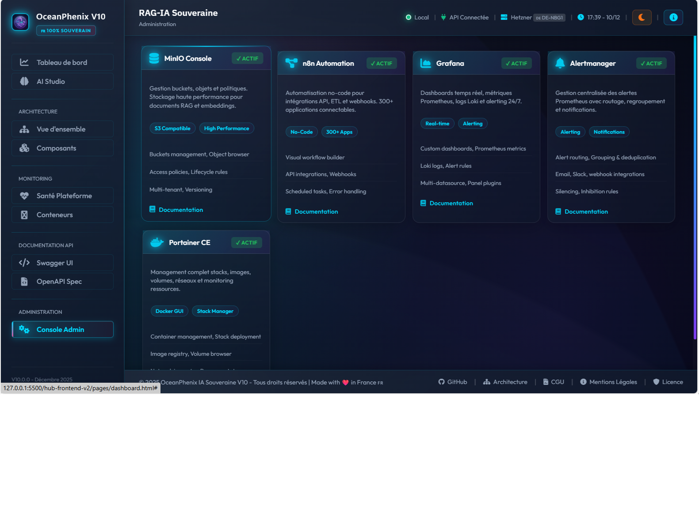
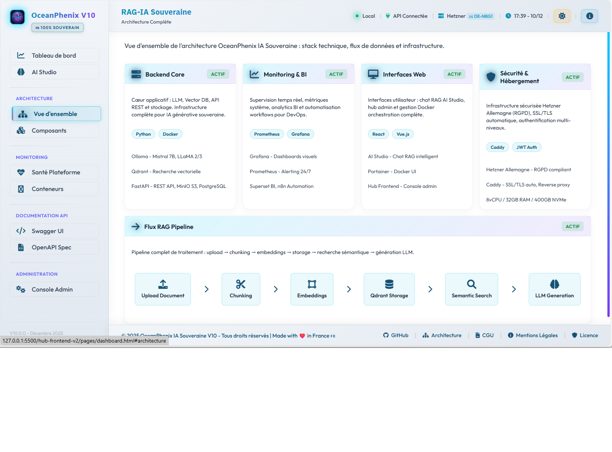
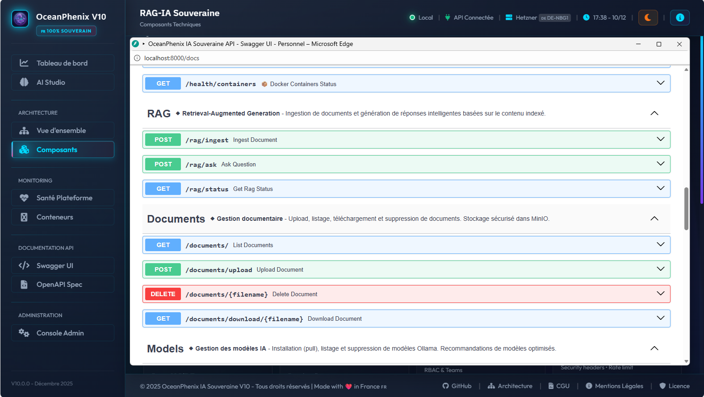
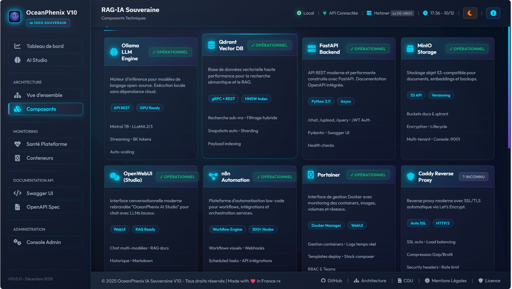
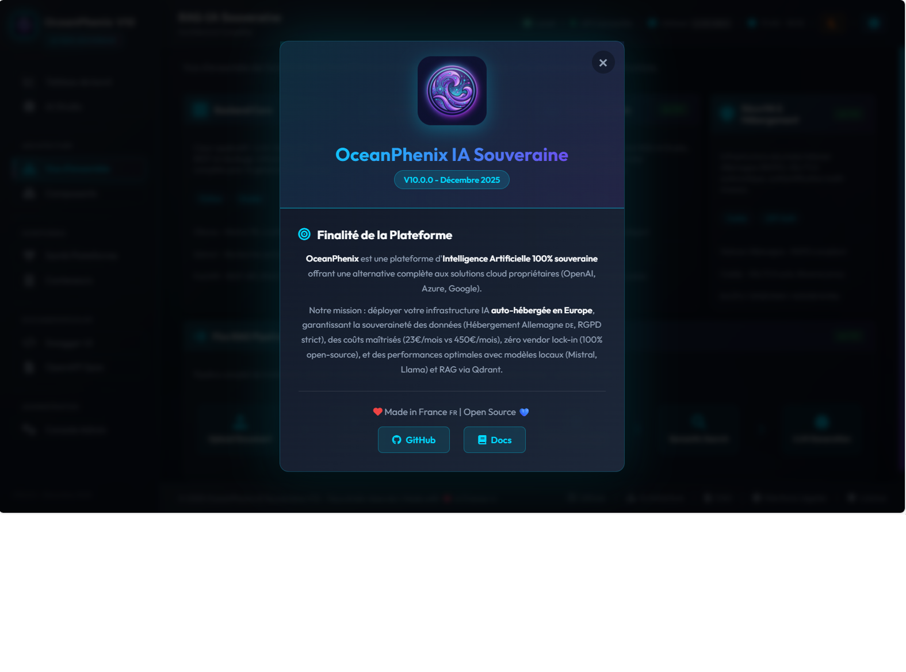
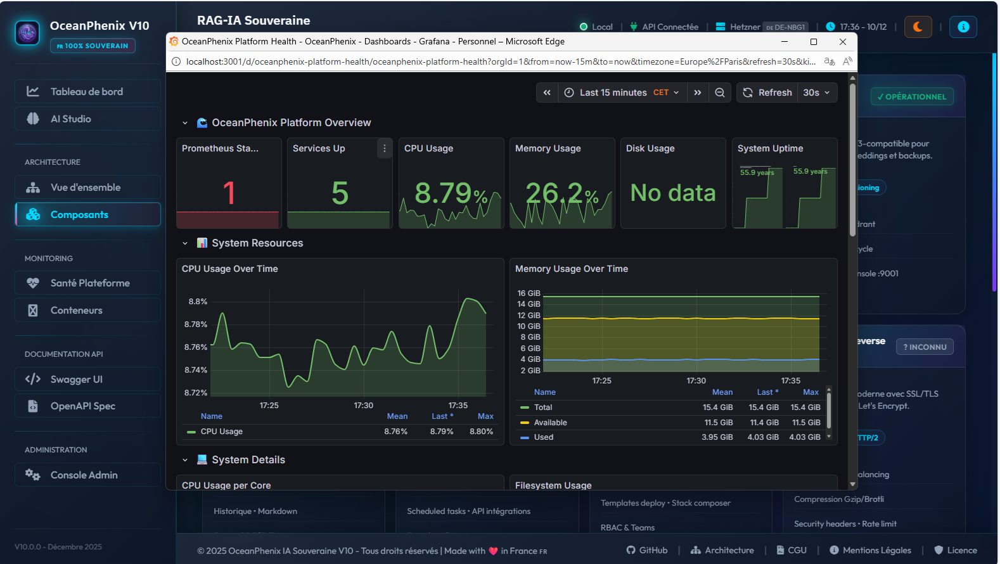

# 🌊 OceanPhenix IA Souveraine V10 - Documentation

> **Plateforme d'Intelligence Artificielle 100% Auto-Hébergée**  
> Architecture hybride Frontend (O2Switch) + Backend (Hetzner)

---

## 📸 Aperçu Visuel

### Interface d'Administration

<table>
  <tr>
    <td align="center">
       
      <b>Tableau de bord Admin</b>
    </td>
    <td align="center">
       
      <b>Interface Utilisateur</b>
    </td>
  </tr>
</table>

### Services et Composants

<table>
  <tr>
    <td align="center">
       
      <b>AI Studio - Open WebUI</b>
    </td>
    <td align="center">
       
      <b>API FastAPI Backend</b>
    </td>
    <td align="center">
       
      <b>Architecture Composants</b>
    </td>
  </tr>
  <tr>
    <td align="center">
       
      <b>Interconnexion Services</b>
    </td>
    <td align="center">
       
      <b>Diagramme Architecture</b>
    </td>
    <td align="center">
       
      <b>Vue Application</b>
    </td>
  </tr>
</table>

### Cas d'Usage

<table>
  <tr>
    <td align="center">
       
      <b>Application Santé Publique</b>
    </td>
    <td align="center">
       
      <b>Tech to Business</b>
    </td>
  </tr>
</table>

---

## 📚 Documentation Complète

### 📖 Table des Matières

1. **[Analyse du Projet](./docs/ANALYSE_PROJET.md)**
   - Vue d'ensemble complète
   - Stack des 17 services Docker
   - Métriques et statistiques clés
   - Configuration réseau et volumes
   - Conformité et sécurité

2. **[Analyse Architecture Expert](./docs/ANALYSE_ARCHITECTURE_EXPERT.md)**
   - Architecture N-Tiers détaillée (5 tiers)
   - Patterns microservices
   - Analyse DevOps et Cloud-Native
   - Recommandations d'optimisation
   - Score de maturité: 4.8/5

3. **[Diagrammes Mermaid](./docs/DIAGRAMS_MERMAID.md)**
   - Diagramme de déploiement global
   - Architecture réseau Docker
   - Flux de données RAG Pipeline
   - Diagrammes de séquence
   - Cartographie des composants

---

## 🏗️ Architecture Technique

### Stack Complète - 17 Services Docker

#### 🔧 Services Core
- **Caddy** - Reverse proxy HTTPS/SSL automatique
- **FastAPI** - API Backend RAG Pipeline
- **Portainer** - Interface de gestion Docker

#### 🤖 Services Intelligence Artificielle
- **Ollama** - Serveur de modèles LLM locaux
- **Open WebUI** - Interface chat IA
- **Qdrant** - Base de données vectorielle
- **PostgreSQL** - Base de données relationnelle

#### 📊 Services Monitoring & BI
- **Grafana** - Dashboards de visualisation
- **Prometheus** - Métriques et alertes
- **Metabase** - Business Intelligence

#### 🔄 Services Automation & Storage
- **n8n** - Workflows automation
- **MinIO** - Stockage S3-compatible
- **Syncthing** - Synchronisation de fichiers

#### 🛠️ Services Support
- **Redis** - Cache et messaging
- **Chroma** - Base vectorielle alternative
- **MariaDB** - Base de données pour n8n

---

## 🚀 Caractéristiques Clés

✅ **100% Auto-hébergé** - Souveraineté totale des données  
✅ **Architecture Hybride** - Frontend O2Switch + Backend Hetzner  
✅ **17 Services Orchestrés** - Docker Compose avec profiles  
✅ **SSL/TLS Automatique** - Let's Encrypt via Caddy  
✅ **RAG Pipeline** - Retrieval Augmented Generation  
✅ **Monitoring Complet** - Grafana + Prometheus  
✅ **BI Intégrée** - Metabase pour l'analyse de données  
✅ **Automation** - Workflows n8n  
✅ **Haute Disponibilité** - Architecture résiliente  

---

## 📊 Métriques du Projet

| Métrique | Valeur |
|----------|--------|
| Services Docker | 17 containers |
| Profiles Docker Compose | 5 (core, rag, monitoring, bi, automation, all) |
| Réseaux Docker | 2 (v10_proxy, v10_internal) |
| Volumes Persistants | 14 volumes |
| Ports Exposés | 18 ports TCP |
| Fichiers Documentation | 19 fichiers Markdown |
| Scripts Déploiement | 4 scripts (bash + PowerShell) |
| Diagrammes Architecture | 6 diagrammes Mermaid |

---

## 🔗 Liens Utiles

- **Repository GitHub**: [oceanphenix-IA-souveraine-v10_2026_DOCS](https://github.com/stepstev/oceanphenix-IA-souveraine-v10_2026_DOCS)
- **Owner**: [@stepstev](https://github.com/stepstev)
- **Version**: V10.0
- **Date**: Décembre 2025

---

## 📝 Licence & Contact

**OceanPhenix IA Souveraine** - Tous droits réservés © 2025

Pour plus d'informations, consultez la [documentation complète](./docs/) dans le dossier `docs/`.

---

  

  <b>🌊 Propulsé par OceanPhenix - Intelligence Artificielle Souveraine</b>

