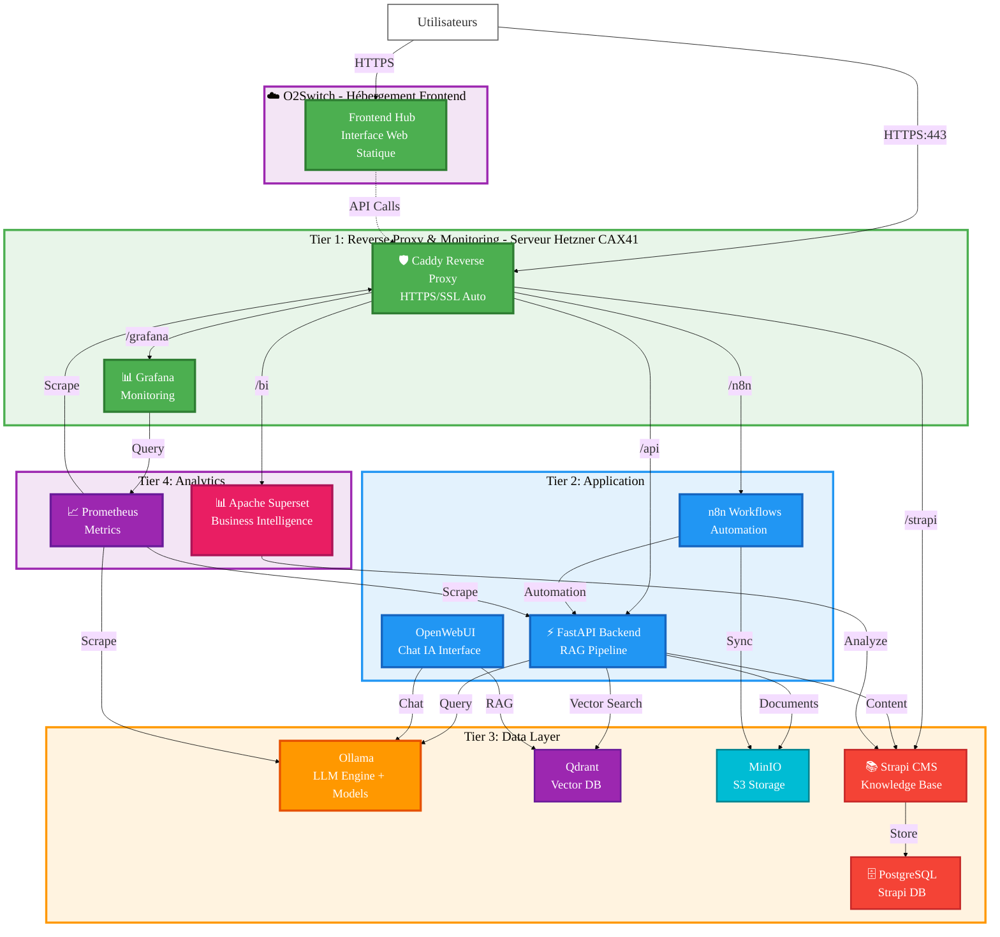
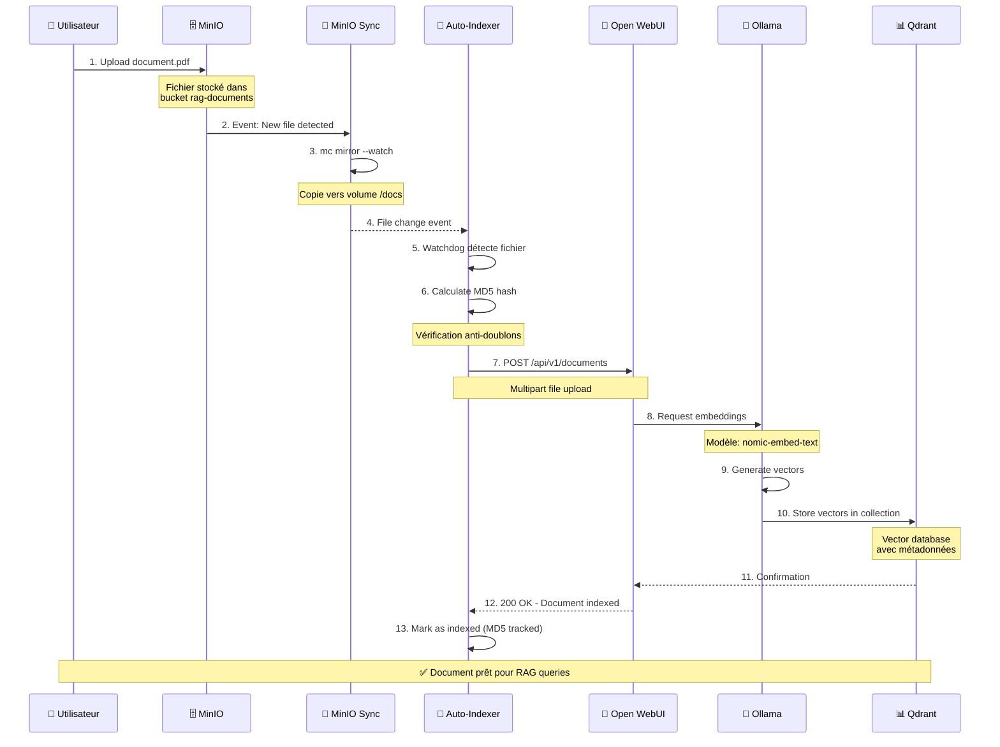
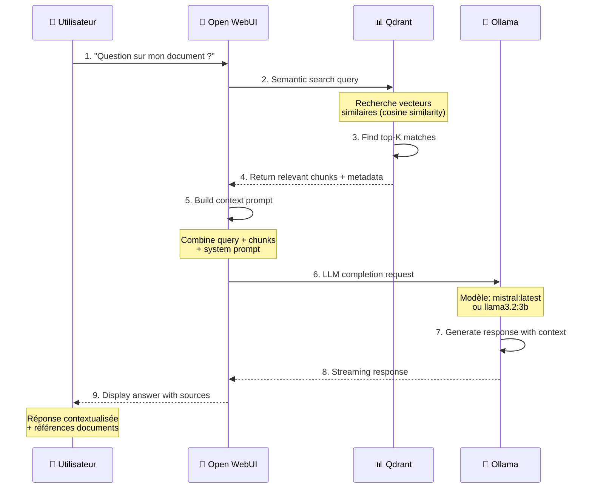
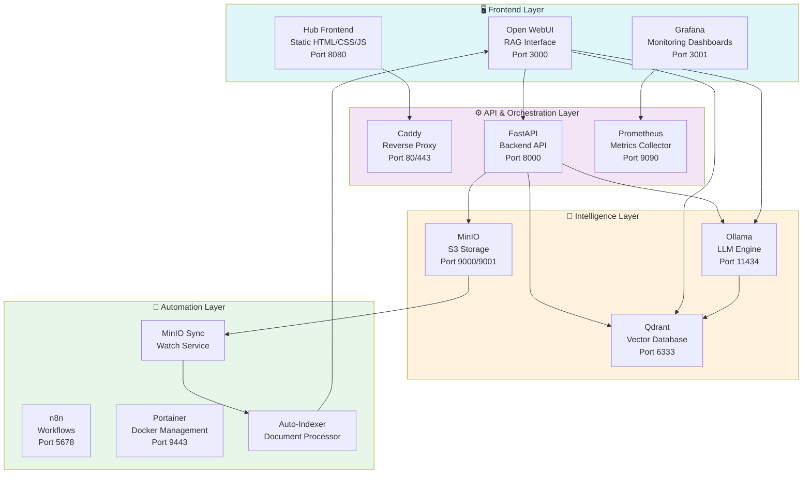
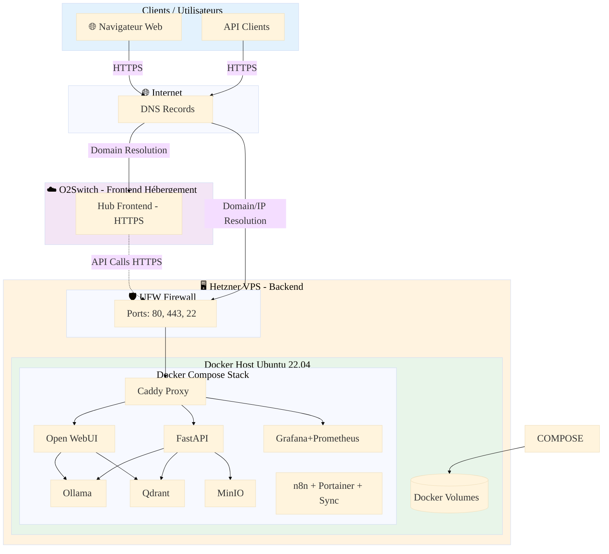
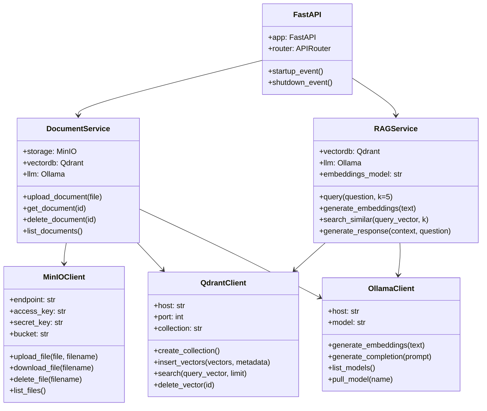

# 🌊 OceanPhenix IA Souveraine V8

[](LICENSE)
[](https://www.docker.com/)
[](https://www.python.org/)
[](https://github.com/open-webui/open-webui)

> **Plateforme IA Souveraine complète** avec RAG (Retrieval-Augmented Generation), auto-hébergée, monitoring 360° et orchestration intelligente.

## ⚡ Installation Rapide (5 minutes)

**📖 [QUICK_START.md](QUICK_START.md)** - Guide express pour tous les modes d'installation

```bash
# Installation locale express
git clone https://github.com/stepstev/oceanphenix-IA-souveraine-v8.git
cd oceanphenix-IA-souveraine-v8
cp .env.example .env  # Éditer avec vos secrets
docker compose --profile all up -d
docker exec v8-ollama ollama pull mistral:latest
# ✅ http://localhost:8080
```

## 📋 Table des Matières

- **[⚡ Installation Rapide (5 min)](QUICK_START.md)** ← Commencer ici
- [Vue d'Ensemble](#-vue-densemble)
- [Architecture](#️-architecture)
- [Fonctionnalités](#-fonctionnalités)
- [Prérequis](#-prérequis)
- [Guides de Déploiement](#-guides-de-déploiement)
- [Configuration](#️-configuration)
- [Utilisation](#-utilisation)
- [Services Inclus](#️-services-inclus)
- [Diagrammes UML](#-diagrammes-uml)
- [API Documentation](#-api-documentation)
- [Maintenance](#-maintenance)
- [Troubleshooting](#-troubleshooting)
- [License](#-license)

## 🎯 Vue d'Ensemble

**OceanPhenix IA Souveraine V8** est une plateforme d'intelligence artificielle complète, auto-hébergée et souveraine, offrant :

- 🤖 **Interface RAG** avec Open WebUI (chat intelligent avec contexte documentaire)
- 🧠 **Modèles LLM locaux** via Ollama (Mistral, Llama, etc.)
- 📊 **Vector Database** Qdrant pour embeddings
- 🗄️ **Stockage S3** MinIO pour documents
- 📈 **Monitoring complet** Grafana + Prometheus
- ⚡ **Automatisation** n8n workflows
- 🐳 **Infrastructure Docker** complète et orchestrée

### 🎯 Cas d'Usage

- ✅ Assistance IA conversationnelle avec contexte métier
- ✅ Analyse de documents avec RAG
- ✅ Automatisation de workflows métier
- ✅ Monitoring infrastructure temps réel
- ✅ Plateforme IA souveraine pour entreprises

## 🏗️ Architecture



## ✨ Fonctionnalités

### Core Features

- ✅ **RAG (Retrieval-Augmented Generation)** : Chat intelligent avec contexte documentaire
- ✅ **Multi-LLM** : Support Mistral, Llama, GPT-like models via Ollama
- ✅ **Vector Search** : Recherche sémantique dans vos documents avec Qdrant
- ✅ **Auto-Indexation** : Upload → MinIO → Vectorisation → RAG (automatique)
- ✅ **S3 Storage** : Stockage documents compatible S3 (MinIO)
- ✅ **API REST** : Backend FastAPI pour intégrations

### Monitoring & Observability

- 📊 **Grafana Dashboards** : Monitoring temps réel (CPU, RAM, Disk, Network)
- 📈 **Prometheus** : Métriques et alerting
- 🔍 **Health Checks** : Surveillance automatique de tous les services
- 📝 **Logs centralisés** : Agrégation et analyse

### Automation & DevOps

- ⚡ **n8n Workflows** : Automatisation no-code (300+ intégrations)
- 🐳 **Docker Compose** : Orchestration complète multi-services
- 🔄 **Auto-sync** : Synchronisation MinIO ↔ Open WebUI
- 🔧 **Portainer** : Interface de gestion Docker

### Security & Sovereignty

- 🔐 **Auto-hébergé** : 100% on-premise, aucune dépendance cloud
- 🇫🇷 **Souverain** : Données en France, conformité RGPD
- 🔒 **Authentification** : Gestion utilisateurs et permissions
- 🛡️ **Reverse Proxy** : Caddy avec SSL automatique

## 🔧 Prérequis

### Hardware Minimum

| Composant | Local Dev | Production |
|-----------|-----------|------------|
| CPU | 4 cores | 8+ cores |
| RAM | 8 GB | 16+ GB |
| Stockage | 50 GB SSD | 200+ GB SSD |
| GPU | Optionnel | Recommandé (NVIDIA) |

### Software

- **Docker** : 24.0+ ([Installation](https://docs.docker.com/get-docker/))
- **Docker Compose** : 2.20+ (inclus avec Docker Desktop)
- **Git** : Pour cloner le repository
- **Ports disponibles** : 3000, 3001, 5678, 6333, 8000, 9000, 9001, 9090, 9443, 11434

### Systèmes Supportés

- ✅ **Linux (Recommandé)** : Ubuntu 22.04 LTS, Debian 11+, CentOS 8+
- ✅ Windows 10/11 avec WSL2
- ✅ macOS 12+ (Intel/Apple Silicon)

## 🚀 Installation Rapide

### Installation en 5 minutes

```bash
# 1. Cloner le repository
git clone https://github.com/stepstev/oceanphenix-IA-souveraine-v8.git
cd oceanphenix-IA-souveraine-v8

# 2. Configurer les variables d'environnement
cp .env.example .env
# ⚠️ IMPORTANT: Éditer .env et remplir vos secrets (voir section Configuration)
nano .env

# 3. Démarrer la stack complète
docker compose --profile all up -d

# 4. Installer un modèle LLM
docker exec v8-ollama ollama pull mistral:latest

# 5. Accéder aux interfaces
# Hub Frontend: http://localhost:8080
# Open WebUI: http://localhost:3000
# MinIO: http://localhost:9001
# Grafana: http://localhost:3001
```

### Vérification

```bash
# Voir les services
docker compose ps

# Vérifier les logs
docker compose logs -f

# Health check
curl http://localhost:8000/health
```

## 📚 Guides de Déploiement

### 💻 Installation Locale

Guide complet pour développement local (Windows, Mac, Linux).

**📖 Voir** : [docs/INSTALL_LOCAL.md](docs/INSTALL_LOCAL.md)

**Étapes principales** :

1. Installation Docker Desktop
2. Clone du repository
3. Configuration `.env` (**⚠️ Ne pas commiter ce fichier**)
4. Lancement avec `docker compose`
5. Installation modèles LLM
6. Test du RAG

---

### 🖥️ Déploiement Serveur Hetzner

Guide pour déploiement production sur VPS Hetzner.

**📖 Voir** : [docs/INSTALL_HETZNER.md](docs/INSTALL_HETZNER.md)

**Étapes principales** :
1. Création serveur Hetzner (Ubuntu 22.04, 8GB+ RAM)
2. Installation Docker
3. Configuration firewall (UFW)
4. Clone et configuration
5. Démarrage stack
6. Configuration domaine et SSL

**Ressources recommandées** :
- **VPS** : CX31 ou supérieur (4 vCPU, 8GB RAM, 160GB SSD)
- **OS** : Ubuntu 22.04 LTS
- **Coût** : ~15€/mois

---

### ☁️ Déploiement Frontend O2Switch

Guide pour hébergement frontend statique sur O2Switch.

**⚡ Guide Express (10 minutes)** : [docs/INSTALL_O2SWITCH_SIMPLE.md](docs/INSTALL_O2SWITCH_SIMPLE.md)

**📖 Guide Complet** : [docs/INSTALL_O2SWITCH.md](docs/INSTALL_O2SWITCH.md)

**Étapes principales** :

1. Copier `config.prod.js` → `config.js` et éditer vos domaines
2. Upload FTP sur O2Switch (`/public_html/ia/`)
3. Configurer CORS sur backend Hetzner pour autoriser le domaine frontend
4. SSL automatique Let's Encrypt
5. Test connexion API

**Connexion API Backend** :

```javascript
// config.js - Configuration API vers Hetzner
apiUrlDefault: 'https://api.votredomaine.com',  // Backend Hetzner
services: {
  api: 'https://api.votredomaine.com/health',
  openwebui: 'https://studio.votredomaine.com/health',
  grafana: 'https://grafana.votredomaine.com/api/health'
}
```

**Avantages O2Switch** :

- Hébergement mutualisé français
- Domaine + SSL inclus
- Upload FTP simple (FileZilla ou cPanel)
- Support francophone
- Coût : ~5€/mois

---

### 🏗️ Architecture Complète

```
┌─────────────────────────────────────────────────────────┐
│              👥 UTILISATEURS                             │
└────────────┬────────────────────────────────────────────┘
             │
             ▼
┌─────────────────────────────────────────────────────────┐
│  ☁️ O2SWITCH (Frontend)                                 │
│  ┌───────────────────────────────────────────────────┐  │
│  │  Hub Frontend (HTML/CSS/JS)                       │  │
│  │  - index.html, app.js, config.prod.js             │  │
│  │  - HTTPS avec Let's Encrypt                       │  │
│  │  - Domaine: votre-domaine.com                     │  │
│  └───────────────────────────────────────────────────┘  │
└────────────┬────────────────────────────────────────────┘
             │ API Calls HTTPS
             ▼
┌─────────────────────────────────────────────────────────┐
│  🖥️ HETZNER VPS (Backend)                               │
│  ┌───────────────────────────────────────────────────┐  │
│  │  🛡️ UFW Firewall (80, 443, 22)                   │  │
│  │  ┌─────────────────────────────────────────────┐  │  │
│  │  │  🐳 Docker Compose Stack                    │  │  │
│  │  │                                              │  │  │
│  │  │  ┌──────────┐  ┌──────────┐  ┌──────────┐  │  │  │
│  │  │  │ Caddy    │  │Open WebUI│  │ Grafana  │  │  │  │
│  │  │  │ (Proxy)  │  │  (RAG)   │  │(Monitor) │  │  │  │
│  │  │  └────┬─────┘  └────┬─────┘  └────┬─────┘  │  │  │
│  │  │       │             │              │         │  │  │
│  │  │  ┌────▼─────────────▼──────────────▼─────┐  │  │  │
│  │  │  │        Backend Services              │  │  │  │
│  │  │  │  - FastAPI  - Ollama  - Qdrant      │  │  │  │
│  │  │  │  - MinIO    - n8n     - Prometheus  │  │  │  │
│  │  │  └─────────────────────────────────────┘  │  │  │
│  │  └─────────────────────────────────────────────┘  │  │
│  └───────────────────────────────────────────────────┘  │
│  IP: xxx.xxx.xxx.xxx                                    │
└─────────────────────────────────────────────────────────┘
```

---

## ⚙️ Configuration

### 🔐 Variables d'Environnement (SÉCURITÉ)

> **⚠️ IMPORTANT : NE JAMAIS COMMITER `.env` SUR GIT**
>
> Le fichier `.env` contient vos **credentials sensibles** (mots de passe, API keys, tokens).
> - ✅ `.env.example` → Commité sur git (valeurs d'exemple)
> - ❌ `.env` → **JAMAIS** sur git (protégé par `.gitignore`)

**1️⃣ Copier le template :**

```bash
cp .env.example .env
```

**2️⃣ Générer des secrets sécurisés :**

```bash
# Générer un mot de passe fort (32 caractères)
openssl rand -base64 32

# Exemple pour MinIO
MINIO_ROOT_PASSWORD=$(openssl rand -base64 24)

# Exemple pour Grafana
GRAFANA_ADMIN_PASSWORD=$(openssl rand -base64 24)
```

**3️⃣ Remplir `.env` avec vos valeurs réelles :**

```env
# ⚠️ Ne pas partager ces valeurs - À compléter avec vos propres secrets
MINIO_ROOT_USER=admin
MINIO_ROOT_PASSWORD=<GENERER_AVEC_OPENSSL>
GRAFANA_ADMIN_PASSWORD=<GENERER_AVEC_OPENSSL>
OPENWEBUI_API_KEY=<VOTRE_CLE_API>
```

Voir `.env.example` pour la liste complète des variables.

### Profils Docker Compose

```bash
# Core services (proxy, monitoring)
docker compose --profile core up -d

# RAG services (Open WebUI, Ollama, Qdrant, MinIO)
docker compose --profile rag up -d

# All services (tout)
docker compose --profile all up -d
```

## 📖 Utilisation

### Interfaces Web

| Service | URL | Identifiants |
|---------|-----|-------------|
| **Hub Frontend** | http://localhost:8080 | Aucun |
| **Open WebUI** | http://localhost:3000 | Signup |
| **MinIO Console** | http://localhost:9001 | admin / [password] |
| **Grafana** | http://localhost:3001 | admin / [password] |
| **n8n** | http://localhost:5678 | Signup |
| **Portainer** | https://localhost:9443 | Signup |
| **Qdrant Dashboard** | http://localhost:6333/dashboard | Aucun |
| **API Swagger** | http://localhost:8000/docs | Aucun |

### Workflow RAG Complet

1. **Upload Document**
   - Aller sur MinIO Console (http://localhost:9001)
   - Login : admin / [votre_password]
   - Upload dans bucket `rag-documents`

2. **Indexation Automatique**
   - Le service `minio-sync` copie le fichier
   - `auto-indexer` détecte et indexe
   - Les embeddings sont générés par Ollama
   - Les vecteurs sont stockés dans Qdrant

3. **Query RAG**
   - Aller sur Open WebUI (http://localhost:3000)
   - Poser une question sur le document
   - Le LLM répond avec le contexte du document

### Commandes Utiles

```bash
# Démarrer
docker compose --profile all up -d

# Arrêter
docker compose down

# Redémarrer un service
docker compose restart openwebui

# Voir les logs
docker logs v8-studio -f
docker logs v8-ollama -f
docker logs v8-auto-indexer -f

# Shell dans un conteneur
docker exec -it v8-studio sh

# Lister modèles LLM
docker exec v8-ollama ollama list

# Backup MinIO
docker exec v8-minio-sync mc mirror minio/rag-documents /backup
```

## 🎛️ Services Inclus

| Service | Description | Port | Ressources |
|---------|-------------|------|------------|
| **Open WebUI** | Interface RAG chat | 3000 | 2GB RAM |
| **Ollama** | Moteur LLM local | 11434 | 4GB RAM, GPU optionnel |
| **Qdrant** | Base vectorielle | 6333 | 1GB RAM |
| **MinIO** | Stockage S3 | 9000, 9001 | 512MB RAM |
| **FastAPI** | Backend API | 8000 | 512MB RAM |
| **Grafana** | Dashboards | 3001 | 512MB RAM |
| **Prometheus** | Métriques | 9090 | 512MB RAM |
| **n8n** | Automation | 5678 | 512MB RAM |
| **Portainer** | Docker UI | 9443 | 256MB RAM |
| **Caddy** | Reverse Proxy | 80, 443 | 128MB RAM |

**Total recommandé** : 16GB RAM, 8 CPU cores, 200GB SSD

## 📊 Diagrammes UML

### Diagramme de Séquence - Upload & Indexation RAG



### Diagramme de Séquence - RAG Query



### Diagramme de Composants



### Diagramme de Déploiement



### Diagramme de Classes - Backend API



## 📚 API Documentation

### Backend API (FastAPI)

**Base URL** : `http://localhost:8000`

**Swagger UI** : http://localhost:8000/docs  
**ReDoc** : http://localhost:8000/redoc

#### Endpoints principaux

```bash
# Health check
GET /health

# Documents
GET  /api/documents         # Liste documents
POST /api/documents         # Upload document
GET  /api/documents/{id}    # Get document
DELETE /api/documents/{id}  # Supprimer document

# RAG
POST /api/rag/query         # RAG query
GET  /api/rag/collections   # Liste collections

# Models
GET /api/models             # Liste modèles LLM
POST /api/models/pull       # Pull nouveau modèle
```

#### Exemples cURL

```bash
# Health check
curl http://localhost:8000/health

# Upload document
curl -X POST http://localhost:8000/api/documents \
  -F "file=@document.pdf" \
  -H "Content-Type: multipart/form-data"

# RAG query
curl -X POST http://localhost:8000/api/rag/query \
  -H "Content-Type: application/json" \
  -d '{
    "query": "Quelle est la politique de remboursement ?",
    "k": 5
  }'

# List models
curl http://localhost:8000/api/models
```

### Open WebUI API

**Base URL** : `http://localhost:3000`

**Documentation** : https://docs.openwebui.com/api

Pour générer une API Key :
1. Open WebUI → Settings
2. Account → API Keys
3. Create new key
4. Copier dans `.env` : `OPENWEBUI_API_KEY=sk-...`

## 🔧 Maintenance

### Backup

```bash
# Backup volumes Docker
docker run --rm \
  -v oceanphenix-v8_minio_data:/data \
  -v $(pwd)/backups:/backup \
  alpine tar czf /backup/minio-$(date +%Y%m%d).tar.gz /data

# Backup Qdrant
docker exec v8-qdrant tar czf /tmp/qdrant-backup.tar.gz /qdrant/storage
docker cp v8-qdrant:/tmp/qdrant-backup.tar.gz ./backups/

# Backup configuration
tar czf config-backup-$(date +%Y%m%d).tar.gz .env docker-compose.yml
```

### Mise à Jour

```bash
# Pull dernières images
docker compose pull

# Redémarrer services
docker compose --profile all up -d

# Vérifier
docker compose ps
docker compose logs -f
```

### Monitoring

Dashboards Grafana disponibles :
- **Platform Health** : CPU, RAM, Disk, Network
- **Docker Stats** : Containers, images, volumes
- **Ollama Performance** : Requêtes LLM, latence
- **MinIO Metrics** : Stockage, bande passante

## 🐛 Troubleshooting

### Open WebUI erreur 500

```bash
# Voir logs
docker logs v8-studio --tail 100

# Redémarrer
docker compose restart openwebui

# Si problème persiste
docker compose down
docker volume rm oceanphenix-v8_openwebui_data
docker compose --profile all up -d
```

### Ollama modèle non trouvé

```bash
# Lister modèles
docker exec v8-ollama ollama list

# Réinstaller
docker exec v8-ollama ollama pull mistral:latest

# Test connexion
curl http://localhost:11434/api/tags
```

### MinIO bucket non créé

```bash
# Logs sync
docker logs v8-minio-sync

# Créer manuellement
docker exec v8-minio-sync mc mb minio/rag-documents

# Vérifier
docker exec v8-minio-sync mc ls minio/
```

### Ports déjà utilisés

```bash
# Windows
netstat -ano | findstr :3000

# Linux/Mac
lsof -i :3000

# Changer port dans docker-compose.yml
ports:
  - "3010:3000"  # Utiliser 3010 au lieu de 3000
```

## 📄 License

Ce projet est sous licence MIT. Voir [LICENSE](LICENSE) pour plus de détails.

## 🔗 Liens Utiles

- **Repository GitHub** : https://github.com/stepstev/oceanphenix-IA-souveraine-v8
- **Documentation** : [docs/](docs/)
- **Issues** : https://github.com/stepstev/oceanphenix-IA-souveraine-v8/issues

---

**Développé avec ❤️ par l'équipe OceanPhenix**

*Version 8.0.0 - Décembre 2025*
