# 🌊 OceanPhenix IA Souveraine V8

[](LICENSE)
[](https://www.docker.com/)
[](https://www.python.org/)
[](https://github.com/open-webui/open-webui)

> **Plateforme IA Souveraine complète** avec RAG (Retrieval-Augmented Generation), auto-hébergée, monitoring 360° et orchestration intelligente.

## 📋 Table des Matières

- [Vue d'Ensemble](#-vue-densemble)
- [Architecture](#️-architecture)
- [Fonctionnalités](#-fonctionnalités)
- [Prérequis](#-prérequis)
- [Installation Rapide](#-installation-rapide)
- [Guides de Déploiement](#-guides-de-déploiement)
- [Configuration](#️-configuration)
- [Utilisation](#-utilisation)
- [Services Inclus](#️-services-inclus)
- [Diagrammes UML](#-diagrammes-uml)
- [API Documentation](#-api-documentation)
- [Maintenance](#-maintenance)
- [Troubleshooting](#-troubleshooting)
- [License](#-license)

## 🎯 Vue d'Ensemble

**OceanPhenix IA Souveraine V8** est une plateforme d'intelligence artificielle complète, auto-hébergée et souveraine, offrant :

- 🤖 **Interface RAG** avec Open WebUI (chat intelligent avec contexte documentaire)
- 🧠 **Modèles LLM locaux** via Ollama (Mistral, Llama, etc.)
- 📊 **Vector Database** Qdrant pour embeddings
- 🗄️ **Stockage S3** MinIO pour documents
- 📈 **Monitoring complet** Grafana + Prometheus
- ⚡ **Automatisation** n8n workflows
- 🐳 **Infrastructure Docker** complète et orchestrée

### 🎯 Cas d'Usage

- ✅ Assistance IA conversationnelle avec contexte métier
- ✅ Analyse de documents avec RAG
- ✅ Automatisation de workflows métier
- ✅ Monitoring infrastructure temps réel
- ✅ Plateforme IA souveraine pour entreprises

## 🏗️ Architecture

```mermaid
%%{init: {'theme':'base', 'themeVariables': {'fontSize':'24px', 'fontFamily':'Arial, sans-serif'}}}%%
graph TB
    %% Définition des styles
    classDef tierPresentation fill:#4CAF50,stroke:#2E7D32,stroke-width:4px,color:#fff,font-size:22px
    classDef tierApp fill:#2196F3,stroke:#1565C0,stroke-width:4px,color:#fff,font-size:22px
    classDef tierData fill:#FF9800,stroke:#E65100,stroke-width:4px,color:#fff,font-size:22px
    classDef tierAnalytics fill:#9C27B0,stroke:#6A1B9A,stroke-width:4px,color:#fff,font-size:22px
    classDef tierBi fill:#E91E63,stroke:#AD1457,stroke-width:4px,color:#fff,font-size:22px
    classDef storage fill:#00BCD4,stroke:#00838F,stroke-width:3px,color:#fff,font-size:22px
    classDef vectordb fill:#9C27B0,stroke:#6A1B9A,stroke-width:3px,color:#fff,font-size:22px
    classDef strapi fill:#F44336,stroke:#C62828,stroke-width:3px,color:#fff,font-size:22px
    
    %% Internet
    Users[👥 Utilisateurs]
    
    %% O2Switch - Frontend statique
    subgraph O2["☁️ O2Switch - Hébergement Frontend"]
        HubFront[📱 Frontend Hub<br/>Interface Web Statique]:::tierPresentation
    end
    
    %% Tier 1: Reverse Proxy & Monitoring - Serveur Hetzner CAX41
    subgraph T1[" Tier 1: Reverse Proxy & Monitoring - Serveur Hetzner CAX41"]
        Caddy[🛡️ Caddy Reverse Proxy<br/>HTTPS/SSL Auto]:::tierPresentation
        Grafana[📊 Grafana<br/>Monitoring]:::tierPresentation
    end
    
    %% Tier 2: Application
    subgraph T2[" Tier 2: Application"]
        FastAPI[⚡ FastAPI Backend<br/>RAG Pipeline]:::tierApp
        OpenWebUI[💬 OpenWebUI<br/>Chat IA Interface]:::tierApp
        N8N[🔄 n8n Workflows<br/>Automation]:::tierApp
    end
    
    %% Tier 3: Data Layer
    subgraph T3[" Tier 3: Data Layer"]
        Ollama[🤖 Ollama<br/>LLM Engine + Models]:::tierData
        Qdrant[🔮 Qdrant<br/>Vector DB]:::vectordb
        MinIO[💾 MinIO<br/>S3 Storage]:::storage
        Strapi[📚 Strapi CMS<br/>Knowledge Base]:::strapi
        PostgreSQL[🗄️ PostgreSQL<br/>Strapi DB]:::strapi
    end
    
    %% Tier 4: Analytics
    subgraph T4[" Tier 4: Analytics"]
        Prometheus[📈 Prometheus<br/>Metrics]:::tierAnalytics
        ApacheBI[📊 Apache Superset<br/>Business Intelligence]:::tierBi
    end
    
    %% Connexions Internet → O2Switch & Hetzner
    Users -->|HTTPS| HubFront
    Users -->|HTTPS:443| Caddy
    HubFront -.->|API Calls| Caddy
    
    %% Caddy routing
    Caddy -->|/grafana| Grafana
    Caddy -->|/bi| ApacheBI
    Caddy -->|/n8n| N8N
    Caddy -->|/api| FastAPI
    Caddy -->|/strapi| Strapi
    
    %% Tier 2 → Tier 3
    FastAPI -->|Query| Ollama
    FastAPI -->|Vector Search| Qdrant
    FastAPI -->|Documents| MinIO
    FastAPI -->|Content| Strapi
    OpenWebUI -->|Chat| Ollama
    OpenWebUI -->|RAG| Qdrant
    N8N -->|Automation| FastAPI
    N8N -->|Sync| MinIO
    Strapi -->|Store| PostgreSQL
    
    %% Tier 4 Monitoring
    Grafana -->|Query| Prometheus
    Prometheus -->|Scrape| FastAPI
    Prometheus -->|Scrape| Ollama
    Prometheus -->|Scrape| Caddy
    ApacheBI -->|Analyze| Strapi
    
    %% Styling tiers
    style O2 fill:#F3E5F5,stroke:#9C27B0,stroke-width:4px
    style T1 fill:#E8F5E9,stroke:#4CAF50,stroke-width:4px
    style T2 fill:#E3F2FD,stroke:#2196F3,stroke-width:4px
    style T3 fill:#FFF3E0,stroke:#FF9800,stroke-width:4px
    style T4 fill:#F3E5F5,stroke:#9C27B0,stroke-width:4px
    style Users fill:#FFF,stroke:#666,stroke-width:2px
```



## ✨ Fonctionnalités

### Core Features

- ✅ **RAG (Retrieval-Augmented Generation)** : Chat intelligent avec contexte documentaire
- ✅ **Multi-LLM** : Support Mistral, Llama, GPT-like models via Ollama
- ✅ **Vector Search** : Recherche sémantique dans vos documents avec Qdrant
- ✅ **Auto-Indexation** : Upload → MinIO → Vectorisation → RAG (automatique)
- ✅ **S3 Storage** : Stockage documents compatible S3 (MinIO)
- ✅ **API REST** : Backend FastAPI pour intégrations

### Monitoring & Observability

- 📊 **Grafana Dashboards** : Monitoring temps réel (CPU, RAM, Disk, Network)
- 📈 **Prometheus** : Métriques et alerting
- 🔍 **Health Checks** : Surveillance automatique de tous les services
- 📝 **Logs centralisés** : Agrégation et analyse

### Automation & DevOps

- ⚡ **n8n Workflows** : Automatisation no-code (300+ intégrations)
- 🐳 **Docker Compose** : Orchestration complète multi-services
- 🔄 **Auto-sync** : Synchronisation MinIO ↔ Open WebUI
- 🔧 **Portainer** : Interface de gestion Docker

### Security & Sovereignty

- 🔐 **Auto-hébergé** : 100% on-premise, aucune dépendance cloud
- 🇫🇷 **Souverain** : Données en France, conformité RGPD
- 🔒 **Authentification** : Gestion utilisateurs et permissions
- 🛡️ **Reverse Proxy** : Caddy avec SSL automatique

## 🔧 Prérequis

### Hardware Minimum

| Composant | Local Dev | Production |
|-----------|-----------|------------|
| CPU | 4 cores | 8+ cores |
| RAM | 8 GB | 16+ GB |
| Stockage | 50 GB SSD | 200+ GB SSD |
| GPU | Optionnel | Recommandé (NVIDIA) |

### Software

- **Docker** : 24.0+ ([Installation](https://docs.docker.com/get-docker/))
- **Docker Compose** : 2.20+ (inclus avec Docker Desktop)
- **Git** : Pour cloner le repository
- **Ports disponibles** : 3000, 3001, 5678, 6333, 8000, 9000, 9001, 9090, 9443, 11434

### Systèmes Supportés

- ✅ Linux (Ubuntu 22.04+, Debian 11+, CentOS 8+)
- ✅ Windows 10/11 avec WSL2
- ✅ macOS 12+ (Intel/Apple Silicon)

## 🚀 Installation Rapide

### Installation en 5 minutes

```bash
# 1. Cloner le repository
git clone https://github.com/stepstev/oceanphenix-IA-souveraine-v8.git
cd oceanphenix-IA-souveraine-v8

# 2. Configurer les variables d'environnement
cp .env.example .env

# 3. Démarrer la stack complète
docker compose --profile all up -d

# 4. Installer un modèle LLM
docker exec v8-ollama ollama pull mistral:latest

# 5. Accéder aux interfaces
# Hub Frontend: http://localhost:8080
# Open WebUI: http://localhost:3000
# MinIO: http://localhost:9001
# Grafana: http://localhost:3001
```

### Vérification

```bash
# Voir les services
docker compose ps

# Vérifier les logs
docker compose logs -f

# Health check
curl http://localhost:8000/health
```

## 📚 Guides de Déploiement

### 💻 Installation Locale

Guide complet pour développement local (Windows, Mac, Linux).

**📖 Voir** : [docs/INSTALL_LOCAL.md](docs/INSTALL_LOCAL.md)

**Étapes principales** :
1. Installation Docker Desktop
2. Clone du repository
3. Configuration `.env`
4. Lancement avec `docker compose`
5. Installation modèles LLM
6. Test du RAG

---

### 🖥️ Déploiement Serveur Hetzner

Guide pour déploiement production sur VPS Hetzner.

**📖 Voir** : [docs/INSTALL_HETZNER.md](docs/INSTALL_HETZNER.md)

**Étapes principales** :
1. Création serveur Hetzner (Ubuntu 22.04, 8GB+ RAM)
2. Installation Docker
3. Configuration firewall (UFW)
4. Clone et configuration
5. Démarrage stack
6. Configuration domaine et SSL

**Ressources recommandées** :
- **VPS** : CX31 ou supérieur (4 vCPU, 8GB RAM, 160GB SSD)
- **OS** : Ubuntu 22.04 LTS
- **Coût** : ~15€/mois

---

### ☁️ Déploiement Frontend O2Switch

Guide pour hébergement frontend statique sur O2Switch.

**📖 Voir** : [docs/INSTALL_O2SWITCH.md](docs/INSTALL_O2SWITCH.md)

**Étapes principales** :
1. Préparation archive frontend
2. Upload FTP vers O2Switch
3. Configuration `config.prod.js` avec IP Hetzner
4. Activation HTTPS (Let's Encrypt)
5. Test de l'intégration

**Avantages O2Switch** :
- Hébergement mutualisé français
- Domaine + SSL inclus
- Support francophone
- Coût : ~5€/mois

---

### 🏗️ Architecture Complète

```
┌─────────────────────────────────────────────────────────┐
│              👥 UTILISATEURS                             │
└────────────┬────────────────────────────────────────────┘
             │
             ▼
┌─────────────────────────────────────────────────────────┐
│  ☁️ O2SWITCH (Frontend)                                 │
│  ┌───────────────────────────────────────────────────┐  │
│  │  Hub Frontend (HTML/CSS/JS)                       │  │
│  │  - index.html, app.js, config.prod.js             │  │
│  │  - HTTPS avec Let's Encrypt                       │  │
│  │  - Domaine: votre-domaine.com                     │  │
│  └───────────────────────────────────────────────────┘  │
└────────────┬────────────────────────────────────────────┘
             │ API Calls HTTPS
             ▼
┌─────────────────────────────────────────────────────────┐
│  🖥️ HETZNER VPS (Backend)                               │
│  ┌───────────────────────────────────────────────────┐  │
│  │  🛡️ UFW Firewall (80, 443, 22)                   │  │
│  │  ┌─────────────────────────────────────────────┐  │  │
│  │  │  🐳 Docker Compose Stack                    │  │  │
│  │  │                                              │  │  │
│  │  │  ┌──────────┐  ┌──────────┐  ┌──────────┐  │  │  │
│  │  │  │ Caddy    │  │Open WebUI│  │ Grafana  │  │  │  │
│  │  │  │ (Proxy)  │  │  (RAG)   │  │(Monitor) │  │  │  │
│  │  │  └────┬─────┘  └────┬─────┘  └────┬─────┘  │  │  │
│  │  │       │             │              │         │  │  │
│  │  │  ┌────▼─────────────▼──────────────▼─────┐  │  │  │
│  │  │  │        Backend Services              │  │  │  │
│  │  │  │  - FastAPI  - Ollama  - Qdrant      │  │  │  │
│  │  │  │  - MinIO    - n8n     - Prometheus  │  │  │  │
│  │  │  └─────────────────────────────────────┘  │  │  │
│  │  └─────────────────────────────────────────────┘  │  │
│  └───────────────────────────────────────────────────┘  │
│  IP: xxx.xxx.xxx.xxx                                    │
└─────────────────────────────────────────────────────────┘
```

---

## ⚙️ Configuration

### Profils Docker Compose

```bash
# Core services (proxy, monitoring)
docker compose --profile core up -d

# RAG services (Open WebUI, Ollama, Qdrant, MinIO)
docker compose --profile rag up -d

# All services (tout)
docker compose --profile all up -d
```

### Variables d'Environnement

Fichier `.env` :

```env
# === MINIO S3 STORAGE ===
MINIO_ROOT_USER=admin
MINIO_ROOT_PASSWORD=VotreMotDePasseSecurise123!
MINIO_BUCKET_RAG=rag-documents

# === GRAFANA ===
GRAFANA_ADMIN_PASSWORD=VotreMotDePasseGrafana456!

# === OPEN WEBUI ===
OPENWEBUI_API_KEY=

# === BACKEND API ===
API_HOST=0.0.0.0
API_PORT=8000

# === OLLAMA ===
OLLAMA_HOST=http://ollama:11434
```

## 📖 Utilisation

### Interfaces Web

| Service | URL | Identifiants |
|---------|-----|-------------|
| **Hub Frontend** | http://localhost:8080 | Aucun |
| **Open WebUI** | http://localhost:3000 | Signup |
| **MinIO Console** | http://localhost:9001 | admin / [password] |
| **Grafana** | http://localhost:3001 | admin / [password] |
| **n8n** | http://localhost:5678 | Signup |
| **Portainer** | https://localhost:9443 | Signup |
| **Qdrant Dashboard** | http://localhost:6333/dashboard | Aucun |
| **API Swagger** | http://localhost:8000/docs | Aucun |

### Workflow RAG Complet

1. **Upload Document**
   - Aller sur MinIO Console (http://localhost:9001)
   - Login : admin / [votre_password]
   - Upload dans bucket `rag-documents`

2. **Indexation Automatique**
   - Le service `minio-sync` copie le fichier
   - `auto-indexer` détecte et indexe
   - Les embeddings sont générés par Ollama
   - Les vecteurs sont stockés dans Qdrant

3. **Query RAG**
   - Aller sur Open WebUI (http://localhost:3000)
   - Poser une question sur le document
   - Le LLM répond avec le contexte du document

### Commandes Utiles

```bash
# Démarrer
docker compose --profile all up -d

# Arrêter
docker compose down

# Redémarrer un service
docker compose restart openwebui

# Voir les logs
docker logs v8-studio -f
docker logs v8-ollama -f
docker logs v8-auto-indexer -f

# Shell dans un conteneur
docker exec -it v8-studio sh

# Lister modèles LLM
docker exec v8-ollama ollama list

# Backup MinIO
docker exec v8-minio-sync mc mirror minio/rag-documents /backup
```

## 🎛️ Services Inclus

| Service | Description | Port | Ressources |
|---------|-------------|------|------------|
| **Open WebUI** | Interface RAG chat | 3000 | 2GB RAM |
| **Ollama** | Moteur LLM local | 11434 | 4GB RAM, GPU optionnel |
| **Qdrant** | Base vectorielle | 6333 | 1GB RAM |
| **MinIO** | Stockage S3 | 9000, 9001 | 512MB RAM |
| **FastAPI** | Backend API | 8000 | 512MB RAM |
| **Grafana** | Dashboards | 3001 | 512MB RAM |
| **Prometheus** | Métriques | 9090 | 512MB RAM |
| **n8n** | Automation | 5678 | 512MB RAM |
| **Portainer** | Docker UI | 9443 | 256MB RAM |
| **Caddy** | Reverse Proxy | 80, 443 | 128MB RAM |

**Total recommandé** : 16GB RAM, 8 CPU cores, 200GB SSD

## 📊 Diagrammes UML

### Diagramme de Séquence - Upload & Indexation RAG

```mermaid
sequenceDiagram
    participant U as 👤 Utilisateur
    participant M as 🗄️ MinIO
    participant S as 🔄 MinIO Sync
    participant I as 🤖 Auto-Indexer
    participant O as 💬 Open WebUI
    participant L as 🧠 Ollama
    participant Q as 📊 Qdrant

    U->>M: 1. Upload document.pdf
    Note over M: Fichier stocké dans<br/>bucket rag-documents
    
    M->>S: 2. Event: New file detected
    S->>S: 3. mc mirror --watch
    Note over S: Copie vers volume /docs
    
    S-->>I: 4. File change event
    I->>I: 5. Watchdog détecte fichier
    I->>I: 6. Calculate MD5 hash
    Note over I: Vérification anti-doublons
    
    I->>O: 7. POST /api/v1/documents
    Note over I,O: Multipart file upload
    
    O->>L: 8. Request embeddings
    Note over L: Modèle: nomic-embed-text
    L->>L: 9. Generate vectors
    
    L->>Q: 10. Store vectors in collection
    Note over Q: Vector database<br/>avec métadonnées
    
    Q-->>O: 11. Confirmation
    O-->>I: 12. 200 OK - Document indexed
    I->>I: 13. Mark as indexed (MD5 tracked)
    
    Note over U,Q: ✅ Document prêt pour RAG queries
```



### Diagramme de Séquence - RAG Query

```mermaid
sequenceDiagram
    participant U as 👤 Utilisateur
    participant O as 💬 Open WebUI
    participant Q as 📊 Qdrant
    participant L as 🧠 Ollama

    U->>O: 1. "Question sur mon document ?"
    
    O->>Q: 2. Semantic search query
    Note over Q: Recherche vecteurs<br/>similaires (cosine similarity)
    
    Q->>Q: 3. Find top-K matches
    Q-->>O: 4. Return relevant chunks + metadata
    
    O->>O: 5. Build context prompt
    Note over O: Combine query + chunks<br/>+ system prompt
    
    O->>L: 6. LLM completion request
    Note over L: Modèle: mistral:latest<br/>ou llama3.2:3b
    
    L->>L: 7. Generate response with context
    L-->>O: 8. Streaming response
    
    O-->>U: 9. Display answer with sources
    Note over U: Réponse contextualisée<br/>+ références documents
```



### Diagramme de Composants


### Diagramme de Déploiement

```mermaid
%%{init: {'theme':'base', 'themeVariables': {'fontSize':'24px', 'fontFamily':'Arial, sans-serif'}}}%%
graph TB
    subgraph Client["👥 Clients / Utilisateurs"]
        BROWSER[🌐 Navigateur Web]
        API_CLIENT[🔌 API Clients]
    end

    subgraph O2Switch["☁️ O2Switch - Frontend Hébergement"]
        STATIC["Hub Frontend - HTTPS"]
    end

    subgraph Internet["🌐 Internet"]
        DNS[🔗 DNS Records]
    end

    subgraph Hetzner["🖥️ Hetzner VPS - Backend"]
        subgraph Firewall["🛡️ UFW Firewall"]
            FW_RULES["Ports: 80, 443, 22"]
        end
        
        subgraph Docker["🐳 Docker Host Ubuntu 22.04"]
            subgraph Compose["Docker Compose Stack"]
                PROXY[Caddy Proxy]
                WEB[Open WebUI]
                API[FastAPI]
                LLM[Ollama]
                VDB[Qdrant]
                S3[MinIO]
                MON[Grafana+Prometheus]
                AUTO_SERVICES["n8n + Portainer + Sync"]
            end
            
            VOLUMES[("Docker Volumes")]
        end
    end

    BROWSER -->|HTTPS| DNS
    API_CLIENT -->|HTTPS| DNS
    DNS -->|Domain Resolution| STATIC
    DNS -->|Domain/IP Resolution| FW_RULES
    
    STATIC -.->|API Calls HTTPS| FW_RULES
    
    FW_RULES --> PROXY
    PROXY --> WEB
    PROXY --> API
    PROXY --> MON
    
    API --> LLM
    API --> VDB
    API --> S3
    WEB --> LLM
    WEB --> VDB
    
    COMPOSE --> VOLUMES
    
    style Client fill:#e3f2fd
    style O2Switch fill:#f3e5f5
    style Hetzner fill:#fff3e0
    style Docker fill:#e8f5e9
```



### Diagramme de Classes - Backend API


## 📚 API Documentation

### Backend API (FastAPI)

**Base URL** : `http://localhost:8000`

**Swagger UI** : http://localhost:8000/docs  
**ReDoc** : http://localhost:8000/redoc

#### Endpoints principaux

```bash
# Health check
GET /health

# Documents
GET  /api/documents         # Liste documents
POST /api/documents         # Upload document
GET  /api/documents/{id}    # Get document
DELETE /api/documents/{id}  # Supprimer document

# RAG
POST /api/rag/query         # RAG query
GET  /api/rag/collections   # Liste collections

# Models
GET /api/models             # Liste modèles LLM
POST /api/models/pull       # Pull nouveau modèle
```

#### Exemples cURL

```bash
# Health check
curl http://localhost:8000/health

# Upload document
curl -X POST http://localhost:8000/api/documents \
  -F "file=@document.pdf" \
  -H "Content-Type: multipart/form-data"

# RAG query
curl -X POST http://localhost:8000/api/rag/query \
  -H "Content-Type: application/json" \
  -d '{
    "query": "Quelle est la politique de remboursement ?",
    "k": 5
  }'

# List models
curl http://localhost:8000/api/models
```

### Open WebUI API

**Base URL** : `http://localhost:3000`

**Documentation** : https://docs.openwebui.com/api

Pour générer une API Key :
1. Open WebUI → Settings
2. Account → API Keys
3. Create new key
4. Copier dans `.env` : `OPENWEBUI_API_KEY=sk-...`

## 🔧 Maintenance

### Backup

```bash
# Backup volumes Docker
docker run --rm \
  -v oceanphenix-v8_minio_data:/data \
  -v $(pwd)/backups:/backup \
  alpine tar czf /backup/minio-$(date +%Y%m%d).tar.gz /data

# Backup Qdrant
docker exec v8-qdrant tar czf /tmp/qdrant-backup.tar.gz /qdrant/storage
docker cp v8-qdrant:/tmp/qdrant-backup.tar.gz ./backups/

# Backup configuration
tar czf config-backup-$(date +%Y%m%d).tar.gz .env docker-compose.yml
```

### Mise à Jour

```bash
# Pull dernières images
docker compose pull

# Redémarrer services
docker compose --profile all up -d

# Vérifier
docker compose ps
docker compose logs -f
```

### Monitoring

Dashboards Grafana disponibles :
- **Platform Health** : CPU, RAM, Disk, Network
- **Docker Stats** : Containers, images, volumes
- **Ollama Performance** : Requêtes LLM, latence
- **MinIO Metrics** : Stockage, bande passante

## 🐛 Troubleshooting

### Open WebUI erreur 500

```bash
# Voir logs
docker logs v8-studio --tail 100

# Redémarrer
docker compose restart openwebui

# Si problème persiste
docker compose down
docker volume rm oceanphenix-v8_openwebui_data
docker compose --profile all up -d
```

### Ollama modèle non trouvé

```bash
# Lister modèles
docker exec v8-ollama ollama list

# Réinstaller
docker exec v8-ollama ollama pull mistral:latest

# Test connexion
curl http://localhost:11434/api/tags
```

### MinIO bucket non créé

```bash
# Logs sync
docker logs v8-minio-sync

# Créer manuellement
docker exec v8-minio-sync mc mb minio/rag-documents

# Vérifier
docker exec v8-minio-sync mc ls minio/
```

### Ports déjà utilisés

```bash
# Windows
netstat -ano | findstr :3000

# Linux/Mac
lsof -i :3000

# Changer port dans docker-compose.yml
ports:
  - "3010:3000"  # Utiliser 3010 au lieu de 3000
```

## 📄 License

Ce projet est sous licence MIT. Voir [LICENSE](LICENSE) pour plus de détails.

## 🔗 Liens Utiles

- **Repository GitHub** : https://github.com/stepstev/oceanphenix-IA-souveraine-v8
- **Documentation** : [docs/](docs/)
- **Issues** : https://github.com/stepstev/oceanphenix-IA-souveraine-v8/issues

---

**Développé avec ❤️ par l'équipe OceanPhenix**

*Version 8.0.0 - Décembre 2025*
