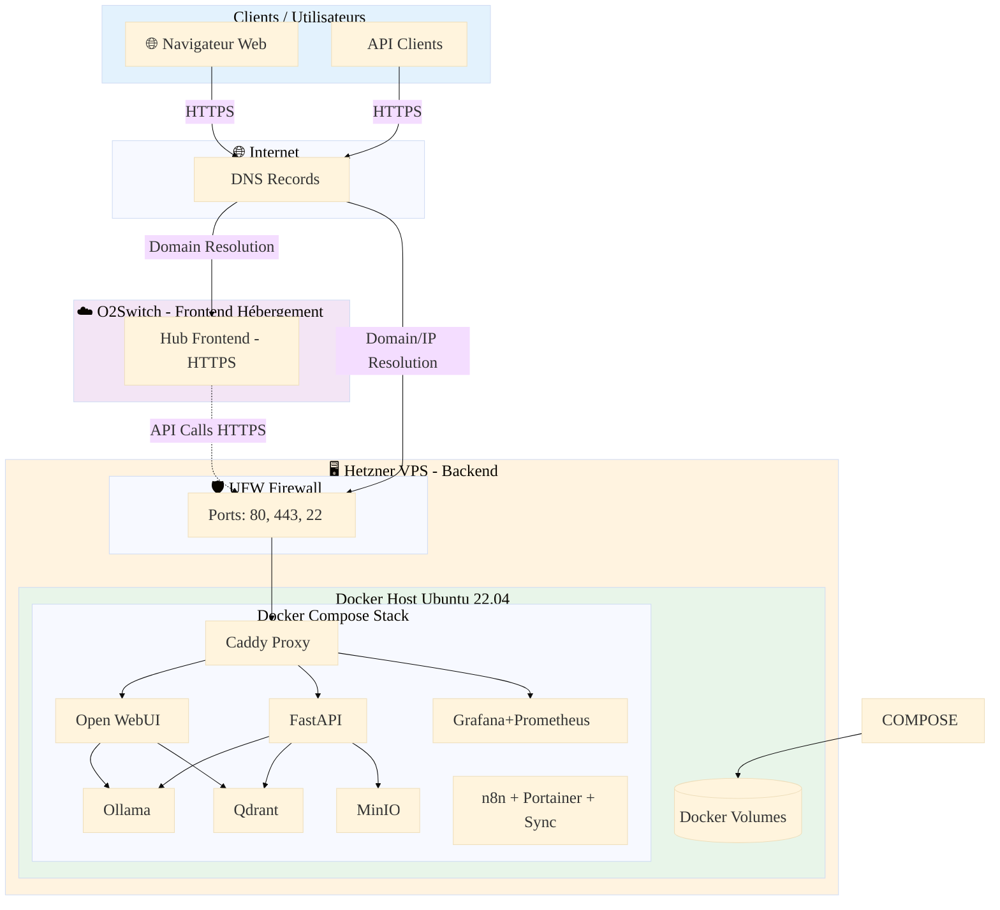
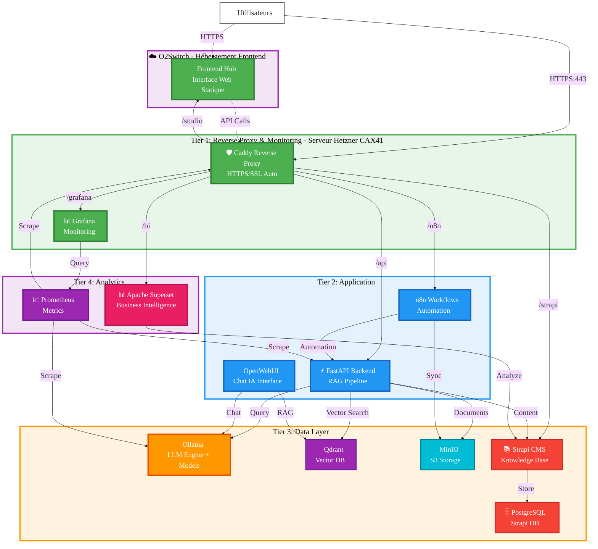
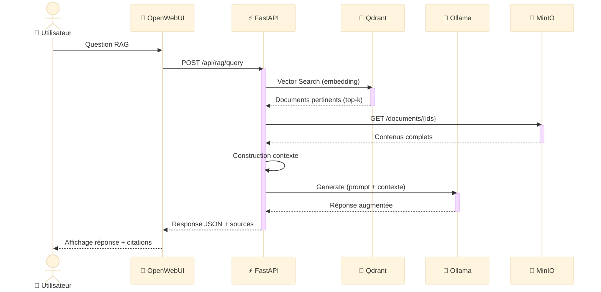
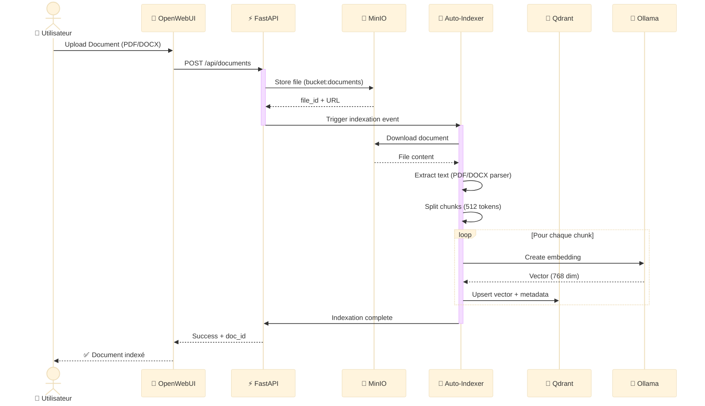
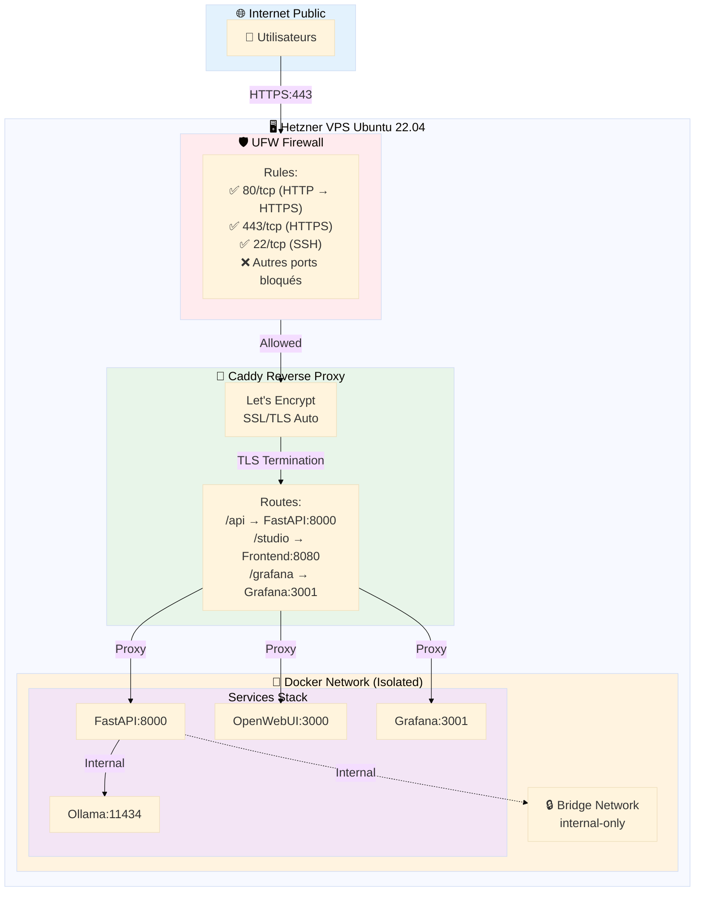
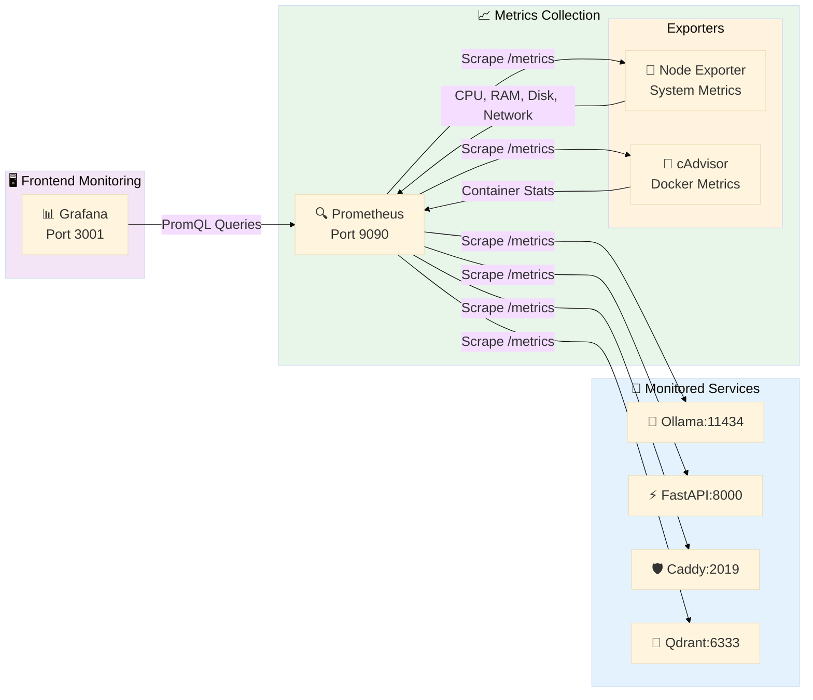
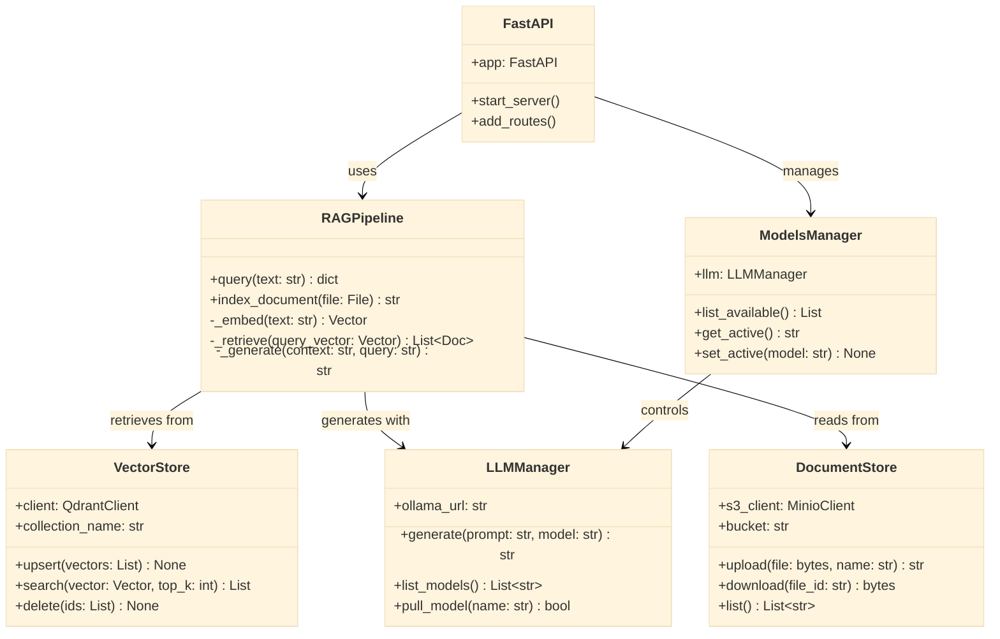
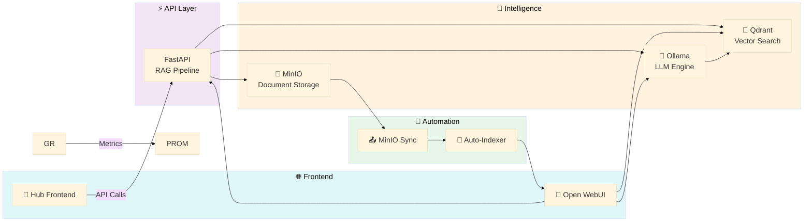

# 📊 Diagrammes Architecture - OceanPhenix

Documentation visuelle avec diagrammes Mermaid (compatibles GitHub).

---

## 📋 Architecture Globale - Vue Déploiement

---

## 🏗️ Architecture 4 Tiers - Serveur Hetzner CAX41

### Légende des Tiers

| Serveur | Tier | Couleur | Rôle | Services |
|---------|------|---------|------|----------|
| **O2Switch** | Frontend | 💜 Violet | Interface utilisateur statique | Hub Frontend (HTML/CSS/JS) |
| **Hetzner** | Tier 1: Reverse Proxy | 🟫 Vert | Exposition HTTPS, Monitoring UI | Caddy, Grafana |
| **Hetzner** | Tier 2: Application | 🔵 Bleu | Logique métier, API, Automation | FastAPI, OpenWebUI, n8n |
| **Hetzner** | Tier 3: Data Layer | 🟠 Orange | Stockage données, LLM, Base de connaissances | Ollama, Qdrant, MinIO, Strapi, PostgreSQL |
| **Hetzner** | Tier 4: Analytics | 🟣 Violet | Métriques, Business Intelligence | Prometheus, Apache Superset |

---

## 🔄 Diagramme de Séquence - Pipeline RAG

---

## 📤 Diagramme de Séquence - Auto-Indexation Documents

---

## 🔐 Diagramme de Composants - Sécurité & Réseau

---

## 📊 Diagramme de Monitoring - Stack Prometheus/Grafana

---

## 🗂️ Diagramme de Classes - Backend API

---

## 🔄 Flux de Données - Architecture Complète

---

## 📚 Ressources

- **GitHub Repository** : [stepstev/oceanphenix-IA-souveraine-v8](<https://github.com/stepstev/oceanphenix-IA-souveraine-v8>)
- **Documentation Installation** : [INSTALL_LOCAL.md](INSTALL_LOCAL.md) | [INSTALL_HETZNER.md](INSTALL_HETZNER.md)
- **Mermaid Live Editor** : <https://mermaid.live>
- **Mermaid Documentation** : <https://mermaid.js.org>

---

**© 2025 OceanPhenix IA Souveraine v8** | Made with ❤️ in France 🇫🇷
