# 📊 Diagrammes Architecture - OceanPhenix

Documentation visuelle avec diagrammes Mermaid (compatibles GitHub).

---

## 📋 Architecture Globale - Vue Déploiement

```mermaid
%%{init: {'theme':'base', 'themeVariables': {'fontSize':'24px', 'fontFamily':'Arial, sans-serif'}}}%%
graph TB
    subgraph Client["👥 Clients / Utilisateurs"]
        BROWSER[🌐 Navigateur Web]
        API_CLIENT[🔌 API Clients]
    end

    subgraph O2Switch["☁️ O2Switch - Frontend Hébergement"]
        STATIC["Hub Frontend - HTTPS"]
    end

    subgraph Internet["🌐 Internet"]
        DNS[🔗 DNS Records]
    end

    subgraph Hetzner["🖥️ Hetzner VPS - Backend"]
        subgraph Firewall["🛡️ UFW Firewall"]
            FW_RULES["Ports: 80, 443, 22"]
        end
        
        subgraph Docker["🐳 Docker Host Ubuntu 22.04"]
            subgraph Compose["Docker Compose Stack"]
                PROXY[Caddy Proxy]
                WEB[Open WebUI]
                API[FastAPI]
                LLM[Ollama]
                VDB[Qdrant]
                S3[MinIO]
                MON[Grafana+Prometheus]
                AUTO_SERVICES["n8n + Portainer + Sync"]
            end
            
            VOLUMES[("Docker Volumes")]
        end
    end

    BROWSER -->|HTTPS| DNS
    API_CLIENT -->|HTTPS| DNS
    DNS -->|Domain Resolution| STATIC
    DNS -->|Domain/IP Resolution| FW_RULES
    
    STATIC -.->|API Calls HTTPS| FW_RULES
    
    FW_RULES --> PROXY
    PROXY --> WEB
    PROXY --> API
    PROXY --> MON
    
    API --> LLM
    API --> VDB
    API --> S3
    WEB --> LLM
    WEB --> VDB
    
    COMPOSE --> VOLUMES
    
    style Client fill:#e3f2fd
    style O2Switch fill:#f3e5f5
    style Hetzner fill:#fff3e0
    style Docker fill:#e8f5e9
```



---

## 🏗️ Architecture 4 Tiers - Serveur Hetzner

```mermaid
%%{init: {'theme':'base', 'themeVariables': {'fontSize':'40px', 'fontFamily':'Arial, sans-serif'}}}%%
graph TB
    %% Définition des styles
    classDef tierPresentation fill:#4CAF50,stroke:#2E7D32,stroke-width:6px,color:#fff,font-size:38px
    classDef tierApp fill:#2196F3,stroke:#1565C0,stroke-width:6px,color:#fff,font-size:38px
    classDef tierData fill:#FF9800,stroke:#E65100,stroke-width:6px,color:#fff,font-size:38px
    classDef tierAnalytics fill:#9C27B0,stroke:#6A1B9A,stroke-width:6px,color:#fff,font-size:38px
    classDef tierBi fill:#E91E63,stroke:#AD1457,stroke-width:6px,color:#fff,font-size:38px
    classDef storage fill:#00BCD4,stroke:#00838F,stroke-width:5px,color:#fff,font-size:38px
    classDef vectordb fill:#9C27B0,stroke:#6A1B9A,stroke-width:5px,color:#fff,font-size:38px
    
    %% Internet
    Users[👥 Utilisateurs]
    
    %% O2Switch - Frontend statique
    subgraph O2["☁️ O2Switch - Hébergement Frontend"]
        HubFront[📱 Hub Frontend V2<br/>v10-frontend<br/>Port 8080]:::tierPresentation
    end
    
    %% Tier 1: Présentation - Serveur Hetzner
    subgraph T1["🖥️ Tier 1: Reverse Proxy & Monitoring - Hetzner"]
        Caddy[🛡️ Caddy Proxy<br/>v10-proxy<br/>Ports 80/443<br/>HTTPS/SSL Auto]:::tierPresentation
        Grafana[📊 Grafana<br/>v10-grafana<br/>Port 3001]:::tierPresentation
        Portainer[🐳 Portainer<br/>v10-portainer<br/>Ports 9443/9002]:::tierPresentation
    end
    
    %% Tier 2: Application
    subgraph T2["⚡ Tier 2: Application Layer"]
        FastAPI[⚡ FastAPI Backend<br/>v10-api<br/>Port 8000<br/>RAG Pipeline]:::tierApp
        OpenWebUI[💬 Open WebUI<br/>v10-studio<br/>Port 3000<br/>Chat IA Interface]:::tierApp
        N8N[🔄 n8n Workflows<br/>v10-n8n v1.120.0<br/>Port 5678<br/>Automation]:::tierApp
    end
    
    %% Tier 3: Data Layer
    subgraph T3["💾 Tier 3: Data & Intelligence Layer"]
        Ollama[🤖 Ollama<br/>v10-ollama<br/>Port 11434<br/>LLM Engine + Models]:::tierData
        Qdrant[🔮 Qdrant<br/>v10-qdrant<br/>Port 6333<br/>Vector Database]:::vectordb
        MinIO[💾 MinIO<br/>v10-minio<br/>Ports 9000/9001<br/>S3 Storage]:::storage
        Postgres[🗄️ PostgreSQL 16<br/>v10-db<br/>Port 5432<br/>Database]:::storage
        Valkey[⚡ Valkey Cache<br/>v10-cache<br/>Port 6379<br/>Redis-compatible]:::storage
    end
    
    %% Tier 4: Analytics & Monitoring
    subgraph T4["📊 Tier 4: Analytics & Monitoring"]
        Prometheus[📈 Prometheus<br/>v10-prometheus<br/>Port 9090<br/>Metrics Collection]:::tierAnalytics
        AlertManager[⚠️ AlertManager<br/>v10-alertmanager<br/>Port 9093<br/>Alertes]:::tierAnalytics
        NodeExporter[📡 Node Exporter<br/>v10-node-exporter<br/>Port 9100<br/>System Metrics]:::tierAnalytics
        Cadvisor[🐳 cAdvisor<br/>v10-cadvisor<br/>Port 8080<br/>Container Metrics]:::tierAnalytics
        ApacheBI[📊 Apache Superset<br/>v10-bi<br/>Port 8088<br/>Business Intelligence]:::tierBi
    end
    
    %% Connexions Internet → O2Switch & Hetzner
    Users -->|HTTPS| HubFront
    Users -->|HTTPS:443| Caddy
    HubFront -.->|API Calls HTTPS| Caddy
    
    %% Caddy routing
    Caddy -->|/grafana| Grafana
    Caddy -->|/portainer| Portainer
    Caddy -->|/bi| ApacheBI
    Caddy -->|/n8n| N8N
    Caddy -->|/studio| OpenWebUI
    Caddy -->|/api| FastAPI
    Caddy -->|/s3| MinIO
    
    %% Tier 2 → Tier 3
    FastAPI -->|Query LLM| Ollama
    FastAPI -->|Vector Search| Qdrant
    FastAPI -->|Documents| MinIO
    FastAPI -->|SQL Queries| Postgres
    OpenWebUI -->|Chat| Ollama
    OpenWebUI -->|RAG| Qdrant
    OpenWebUI -->|Storage| MinIO
    N8N -->|Automation| FastAPI
    N8N -->|Sync| MinIO
    N8N -->|Workflows| Postgres
    ApacheBI -->|Cache| Valkey
    ApacheBI -->|Metadata| Postgres
    
    %% Tier 4 Monitoring
    Grafana -->|Query Metrics| Prometheus
    Prometheus -->|Scrape| FastAPI
    Prometheus -->|Scrape| Ollama
    Prometheus -->|Scrape| Caddy
    Prometheus -->|Scrape| Qdrant
    Prometheus -->|Scrape| MinIO
    Prometheus -->|Scrape| NodeExporter
    Prometheus -->|Scrape| Cadvisor
    Prometheus -->|Send Alerts| AlertManager
    NodeExporter -->|System Stats| Prometheus
    Cadvisor -->|Container Stats| Prometheus
    
    %% Styling tiers
    style O2 fill:#F3E5F5,stroke:#9C27B0,stroke-width:4px
    style T1 fill:#E8F5E9,stroke:#4CAF50,stroke-width:4px
    style T2 fill:#E3F2FD,stroke:#2196F3,stroke-width:4px
    style T3 fill:#FFF3E0,stroke:#FF9800,stroke-width:4px
    style T4 fill:#F3E5F5,stroke:#9C27B0,stroke-width:4px
    style Users fill:#FFF,stroke:#666,stroke-width:2px
```



### Légende des Tiers - Architecture Complète

| Serveur | Tier | Couleur | Rôle | Services (17 containers) |
|---------|------|---------|------|----------|
| **O2Switch** | Frontend | 💜 Violet | Interface utilisateur statique | Hub Frontend V2 (v10-frontend) |
| **Hetzner** | **Tier 1**: Reverse Proxy | 🟢 Vert | Exposition HTTPS, Monitoring UI, Gestion Docker | Caddy (v10-proxy), Grafana (v10-grafana), Portainer (v10-portainer) |
| **Hetzner** | **Tier 2**: Application | 🔵 Bleu | Logique métier, API, Automation | FastAPI (v10-api), Open WebUI (v10-studio), n8n v1.120.0 (v10-n8n) |
| **Hetzner** | **Tier 3**: Data & Intelligence | 🟠 Orange | Stockage, LLM, Vector DB, Cache | Ollama (v10-ollama), Qdrant (v10-qdrant), MinIO (v10-minio), PostgreSQL 16 (v10-db), Valkey (v10-cache) |
| **Hetzner** | **Tier 4**: Analytics & Monitoring | 🟣 Violet | Métriques, Alertes, Business Intelligence | Prometheus (v10-prometheus), AlertManager (v10-alertmanager), Node Exporter (v10-node-exporter), cAdvisor (v10-cadvisor), Apache Superset (v10-bi) |

### 📊 Statistiques Architecture

- **Total Containers**: 17 services Docker
- **Profiles Docker Compose**: 5 profiles (core, rag, monitoring, bi, automation, all)
- **Réseaux Docker**: 2 networks (v10_proxy, v10_internal)
- **Volumes Persistants**: 14 volumes nommés
- **Ports Exposés**: 18 ports (80, 443, 3000, 3001, 5678, 6333, 8000, 8080, 8088, 9000, 9001, 9002, 9090, 9093, 9100, 9443, 11434)

---

## 🔄 Diagramme de Séquence - Pipeline RAG

```mermaid
%%{init: {'theme':'base', 'themeVariables': {'fontSize':'20px'}}}%%
sequenceDiagram
    actor User as 👤 Utilisateur
    participant WEB as 💬 OpenWebUI
    participant API as ⚡ FastAPI
    participant VDB as 🔮 Qdrant
    participant LLM as 🤖 Ollama
    participant S3 as 💾 MinIO

    User->>WEB: Question RAG
    WEB->>API: POST /api/rag/query
    activate API
    
    API->>VDB: Vector Search (embedding)
    activate VDB
    VDB-->>API: Documents pertinents (top-k)
    deactivate VDB
    
    API->>S3: GET /documents/{ids}
    activate S3
    S3-->>API: Contenus complets
    deactivate S3
    
    API->>API: Construction contexte
    API->>LLM: Generate (prompt + contexte)
    activate LLM
    LLM-->>API: Réponse augmentée
    deactivate LLM
    
    API-->>WEB: Response JSON + sources
    deactivate API
    WEB-->>User: Affichage réponse + citations
```



---

## 📤 Diagramme de Séquence - Auto-Indexation Documents

```mermaid
%%{init: {'theme':'base', 'themeVariables': {'fontSize':'20px'}}}%%
sequenceDiagram
    actor User as 👤 Utilisateur
    participant WEB as 💬 OpenWebUI
    participant API as ⚡ FastAPI
    participant S3 as 💾 MinIO
    participant INDEX as 🔄 Auto-Indexer
    participant VDB as 🔮 Qdrant
    participant LLM as 🤖 Ollama

    User->>WEB: Upload Document (PDF/DOCX)
    WEB->>API: POST /api/documents
    activate API
    
    API->>S3: Store file (bucket:documents)
    S3-->>API: file_id + URL
    
    API->>INDEX: Trigger indexation event
    deactivate API
    
    activate INDEX
    INDEX->>S3: Download document
    S3-->>INDEX: File content
    
    INDEX->>INDEX: Extract text (PDF/DOCX parser)
    INDEX->>INDEX: Split chunks (512 tokens)
    
    loop Pour chaque chunk
        INDEX->>LLM: Create embedding
        LLM-->>INDEX: Vector (768 dim)
        INDEX->>VDB: Upsert vector + metadata
    end
    
    INDEX->>API: Indexation complete
    deactivate INDEX
    
    API-->>WEB: Success + doc_id
    WEB-->>User: ✅ Document indexé
```



---

## 🔐 Diagramme de Composants - Sécurité & Réseau

```mermaid
%%{init: {'theme':'base', 'themeVariables': {'fontSize':'20px'}}}%%
graph TB
    subgraph Internet["🌐 Internet Public"]
        USERS[👥 Utilisateurs]
    end
    
    subgraph Hetzner["🖥️ Hetzner VPS Ubuntu 22.04"]
        subgraph FW["🛡️ UFW Firewall"]
            RULES["Rules:<br/>✅ 80/tcp (HTTP → HTTPS)<br/>✅ 443/tcp (HTTPS)<br/>✅ 22/tcp (SSH)<br/>❌ Autres ports bloqués"]
        end
        
        subgraph Caddy["🔐 Caddy Reverse Proxy"]
            SSL["Let's Encrypt<br/>SSL/TLS Auto"]
            ROUTES["Routes:<br/>/api → FastAPI:8000<br/>/studio → Frontend:8080<br/>/grafana → Grafana:3001"]
        end
        
        subgraph Docker["🐳 Docker Network (Isolated)"]
            subgraph Services["Services Stack"]
                API[FastAPI:8000]
                WEB[OpenWebUI:3000]
                GRAF[Grafana:3001]
                OLLAMA[Ollama:11434]
            end
            
            NETWORK["🔒 Bridge Network<br/>internal-only"]
        end
    end
    
    USERS -->|HTTPS:443| FW
    FW -->|Allowed| SSL
    SSL -->|TLS Termination| ROUTES
    
    ROUTES -->|Proxy| API
    ROUTES -->|Proxy| WEB
    ROUTES -->|Proxy| GRAF
    
    API -->|Internal| OLLAMA
    API -.->|Internal| NETWORK
    
    style Internet fill:#e3f2fd
    style FW fill:#ffebee
    style Caddy fill:#e8f5e9
    style Docker fill:#fff3e0
    style Services fill:#f3e5f5
```



---

## 📊 Diagramme de Monitoring - Stack Prometheus/Grafana

```mermaid
%%{init: {'theme':'base', 'themeVariables': {'fontSize':'36px', 'fontFamily':'Arial, sans-serif'}}}%%
graph TB
    subgraph Users["👥 Utilisateurs"]
        ADMIN[🔧 Administrateur]
    end
    
    subgraph Frontend["🖥️ Frontend Monitoring"]
        GRAF[📊 Grafana v10-grafana<br/>Port 3001<br/>Dashboards & Alertes]
    end
    
    subgraph Collection["📈 Metrics Collection"]
        PROM[🔍 Prometheus v10-prometheus<br/>Port 9090<br/>TSDB + Scraping]
        ALERT[⚠️ AlertManager v10-alertmanager<br/>Port 9093<br/>Email/Slack Alerts]
        
        subgraph Exporters["📡 Exporters"]
            NODE[📡 Node Exporter v10-node-exporter<br/>Port 9100<br/>System Metrics<br/>CPU, RAM, Disk, Network]
            CADV[🐳 cAdvisor v10-cadvisor<br/>Port 8080<br/>Container Metrics<br/>Docker Stats]
        end
    end
    
    subgraph Targets["🎯 Monitored Services (Endpoints /metrics)"]
        OLLAMA[🤖 Ollama v10-ollama<br/>Port 11434]
        FAST[⚡ FastAPI v10-api<br/>Port 8000]
        CADDY[🛡️ Caddy v10-proxy<br/>Ports 80/443]
        QDRANT[🔮 Qdrant v10-qdrant<br/>Port 6333]
        MINIO[💾 MinIO v10-minio<br/>Ports 9000/9001]
        N8N[🔄 n8n v10-n8n<br/>Port 5678]
    end
    
    subgraph Alerting["📬 Notification Channels"]
        EMAIL[📧 Email SMTP]
        SLACK[💬 Slack Webhook]
    end
    
    %% Connexions utilisateur
    ADMIN -->|Access Dashboards HTTPS| GRAF
    ADMIN -.->|Direct Access| PROM
    
    %% Grafana → Prometheus
    GRAF -->|PromQL Queries| PROM
    
    %% Prometheus Scraping
    PROM -->|Scrape /metrics 15s| NODE
    PROM -->|Scrape /metrics 15s| CADV
    PROM -->|Scrape /metrics 30s| OLLAMA
    PROM -->|Scrape /metrics 30s| FAST
    PROM -->|Scrape /metrics 30s| CADDY
    PROM -->|Scrape /metrics 30s| QDRANT
    PROM -->|Scrape /metrics 30s| MINIO
    PROM -->|Scrape /metrics 30s| N8N
    
    %% Exporters → Prometheus
    NODE -->|System Metrics| PROM
    CADV -->|Container Metrics| PROM
    
    %% Alerting
    PROM -->|Trigger Rules| ALERT
    ALERT -->|Send Notifications| EMAIL
    ALERT -->|Send Notifications| SLACK
    
    %% Styling
    style Users fill:#e3f2fd,stroke:#1976D2,stroke-width:2px
    style Frontend fill:#f3e5f5,stroke:#7B1FA2,stroke-width:3px
    style Collection fill:#e8f5e9,stroke:#388E3C,stroke-width:3px
    style Exporters fill:#fff3e0,stroke:#F57C00,stroke-width:2px
    style Targets fill:#fce4ec,stroke:#C2185B,stroke-width:3px
    style Alerting fill:#fff9c4,stroke:#F9A825,stroke-width:2px
```



### 📋 Métriques Collectées

| Exporter/Service | Métriques | Scrape Interval | Rétention |
|------------------|-----------|-----------------|-----------|
| **Node Exporter** | CPU usage, RAM, Disk I/O, Network, Load Average | 15s | 15 jours |
| **cAdvisor** | Container CPU, RAM, Network, Disk per container | 15s | 15 jours |
| **Ollama** | Model requests, inference time, GPU usage | 30s | 15 jours |
| **FastAPI** | HTTP requests, response time, error rate | 30s | 15 jours |
| **Qdrant** | Vector count, search latency, memory usage | 30s | 15 jours |
| **MinIO** | Bucket size, object count, API requests | 30s | 15 jours |
| **Caddy** | HTTP requests, SSL certs expiry, proxy errors | 30s | 15 jours |
| **n8n** | Workflow executions, success/error rate | 30s | 15 jours |

### 🚨 Règles d'Alerte Actives

```yaml
# Exemples d'alertes configurées (alert_rules.yml)
- HighCPUUsage: CPU > 80% pendant 5 minutes
- HighMemoryUsage: RAM > 85% pendant 5 minutes  
- ServiceDown: Service inaccessible pendant 1 minute
- DiskSpacelow: Espace disque < 15%
- OllamaSlowResponse: Temps réponse > 30s
- QdrantHighLatency: Latence recherche > 2s
- MinIOHighErrorRate: Taux erreur > 5%
- CaddySSLExpiring: Certificat SSL expire dans 7 jours
```

---

## 🗂️ Diagramme de Classes - Backend API


---

## 🔄 Flux de Données - Architecture Complète V10

```mermaid
%%{init: {'theme':'base', 'themeVariables': {'fontSize':'40px', 'fontFamily':'Arial, sans-serif'}}}%%
graph TB
    subgraph Users["👥 Utilisateurs"]
        USER[🧑 Utilisateur Final]
        ADMIN[🔧 Administrateur]
    end
    
    subgraph O2Switch["☁️ O2Switch - Frontend Hébergé"]
        HUB[📱 Hub Frontend V2<br/>v10-frontend<br/>HTML/CSS/JS Static]
    end
    
    subgraph Hetzner["🖥️ Hetzner VPS - Backend Services"]
        
        subgraph Proxy["🛡️ Reverse Proxy Layer"]
            CADDY[Caddy v10-proxy<br/>Ports 80/443<br/>SSL/TLS]
        end
        
        subgraph Frontend["🎨 Frontend Services"]
            OW[💬 Open WebUI<br/>v10-studio<br/>Port 3000<br/>Chat IA]
            GRAF[📊 Grafana<br/>v10-grafana<br/>Port 3001<br/>Dashboards]
            PORT[🐳 Portainer<br/>v10-portainer<br/>Ports 9443/9002<br/>Docker UI]
        end
        
        subgraph API["⚡ API Layer"]
            FAST[FastAPI v10-api<br/>Port 8000<br/>RAG Pipeline]
        end
        
        subgraph Intelligence["🧠 Intelligence Layer"]
            OLLAMA[🤖 Ollama v10-ollama<br/>Port 11434<br/>LLM Models]
            QDRANT[🔮 Qdrant v10-qdrant<br/>Port 6333<br/>Vector DB]
            MINIO[💾 MinIO v10-minio<br/>Ports 9000/9001<br/>S3 Storage]
            POSTGRES[🗄️ PostgreSQL v10-db<br/>Port 5432<br/>Relational DB]
            VALKEY[⚡ Valkey v10-cache<br/>Port 6379<br/>Cache Redis]
        end
        
        subgraph Automation["🔄 Automation Layer"]
            N8N[🔄 n8n v10-n8n<br/>Port 5678<br/>Workflows]
            SYNC[📤 MinIO Sync<br/>Script]
            AUTO[🔄 Auto-Indexer<br/>Python Script]
        end
        
        subgraph Monitoring["📈 Monitoring Layer"]
            PROM[📊 Prometheus v10-prometheus<br/>Port 9090<br/>Metrics TSDB]
            ALERT[⚠️ AlertManager v10-alertmanager<br/>Port 9093<br/>Notifications]
            NODE[📡 Node Exporter v10-node-exporter<br/>Port 9100]
            CADV[🐳 cAdvisor v10-cadvisor<br/>Port 8080]
        end
        
        subgraph BI["📊 Business Intelligence"]
            SUPER[📊 Apache Superset<br/>v10-bi<br/>Port 8088<br/>Analytics]
        end
    end
    
    %% User flows
    USER -->|HTTPS| HUB
    USER -->|HTTPS| CADDY
    ADMIN -->|HTTPS| CADDY
    
    %% Frontend → Backend
    HUB -.->|API Calls REST| CADDY
    
    %% Caddy routing
    CADDY -->|/studio| OW
    CADDY -->|/api| FAST
    CADDY -->|/grafana| GRAF
    CADDY -->|/portainer| PORT
    CADDY -->|/n8n| N8N
    CADDY -->|/bi| SUPER
    CADDY -->|/s3| MINIO
    
    %% Frontend Services
    OW -->|Chat Requests| OLLAMA
    OW -->|RAG Search| QDRANT
    OW -->|File Storage| MINIO
    
    %% API Layer
    FAST -->|Generate Text| OLLAMA
    FAST -->|Vector Search| QDRANT
    FAST -->|Documents| MINIO
    FAST -->|SQL Queries| POSTGRES
    FAST -->|Cache| VALKEY
    
    %% Automation
    N8N -->|Trigger Workflows| FAST
    N8N -->|Sync Files| MINIO
    N8N -->|Store Data| POSTGRES
    MINIO --> SYNC
    SYNC --> AUTO
    AUTO -->|Index Documents| QDRANT
    AUTO -->|Create Embeddings| OLLAMA
    
    %% Business Intelligence
    SUPER -->|Cache Queries| VALKEY
    SUPER -->|Metadata| POSTGRES
    SUPER -->|Query Metrics| PROM
    
    %% Monitoring
    GRAF -->|PromQL| PROM
    PROM -->|Scrape| FAST
    PROM -->|Scrape| OLLAMA
    PROM -->|Scrape| CADDY
    PROM -->|Scrape| QDRANT
    PROM -->|Scrape| MINIO
    PROM -->|Scrape| N8N
    PROM -->|Scrape| NODE
    PROM -->|Scrape| CADV
    PROM -->|Trigger Alerts| ALERT
    NODE -.->|System Metrics| PROM
    CADV -.->|Container Metrics| PROM
    
    %% Styling
    style Users fill:#e3f2fd,stroke:#1976D2,stroke-width:3px
    style O2Switch fill:#f3e5f5,stroke:#7B1FA2,stroke-width:3px
    style Hetzner fill:#fff3e0,stroke:#F57C00,stroke-width:4px
    style Proxy fill:#e8f5e9,stroke:#388E3C,stroke-width:2px
    style Frontend fill:#e1f5fe,stroke:#0277BD,stroke-width:2px
    style API fill:#f3e5f5,stroke:#6A1B9A,stroke-width:2px
    style Intelligence fill:#fff9c4,stroke:#F9A825,stroke-width:2px
    style Automation fill:#e0f2f1,stroke:#00695C,stroke-width:2px
    style Monitoring fill:#fce4ec,stroke:#C2185B,stroke-width:2px
    style BI fill:#ede7f6,stroke:#4527A0,stroke-width:2px
```



### 📊 Résumé Architecture - 17 Services Docker

| Layer | Services | Containers | Ports Exposés |
|-------|----------|------------|---------------|
| **Reverse Proxy** | Caddy | v10-proxy | 80, 443 |
| **Frontend** | Open WebUI, Grafana, Portainer | v10-studio, v10-grafana, v10-portainer | 3000, 3001, 9443, 9002 |
| **API** | FastAPI | v10-api | 8000 |
| **Intelligence** | Ollama, Qdrant, MinIO, PostgreSQL, Valkey | v10-ollama, v10-qdrant, v10-minio, v10-db, v10-cache | 11434, 6333, 9000, 9001, 5432, 6379 |
| **Automation** | n8n | v10-n8n | 5678 |
| **Monitoring** | Prometheus, AlertManager, Node Exporter, cAdvisor | v10-prometheus, v10-alertmanager, v10-node-exporter, v10-cadvisor | 9090, 9093, 9100, 8080 |
| **Business Intelligence** | Apache Superset | v10-bi | 8088 |
| **Frontend Statique** | Hub Frontend V2 (Nginx) | v10-frontend | 8080 (interne) |

---

## 📚 Ressources

- **GitHub Repository** : [stepstev/oceanphenix-IA-souveraine-v10_2026](<https://github.com/stepstev/oceanphenix-IA-souveraine-v10_2026>)
- **Documentation Installation** : [INSTALL_LOCAL.md](INSTALL_LOCAL.md) | [INSTALL_HETZNER.md](INSTALL_HETZNER.md)
- **Mermaid Live Editor** : <https://mermaid.live>
- **Mermaid Documentation** : <https://mermaid.js.org>

---

**© 2025 OceanPhenix IA Souveraine V10** | Made with ❤️ in France 🇫🇷
